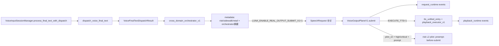

# 当前系统主线状态总图（V1）

## 1. 目标

本文件把当前仓库中**已经落地**的主线工程形态收敛为一张“系统状态总图”，回答：

- 哪些已经进入真实主线、落点在哪
- 哪些还停在 whitebox-only
- 哪些已经具备真实输出链（submit/request/playback）
- 哪些只是旁路观察与编排摘要
- 哪些进入试点、哪些明确禁止扩边界
- 仍未联上的缺口与下一阶段候选工作排序

> 口径：只描述“当前事实”，不做未来形态设计展开。

---

## 2. 总览：主线链路（当前事实）

### 2.1 语音输入主线入口（事实）

- `VoiceInputSessionManager.process_final_text_with_dispatch(...)`  
  组装 `VoiceInputEvent`，并进入主分流 `dispatch_voice_final_text(...)`。

### 2.2 主分流与编排入口（事实）

- 主分流：`capabilities/voice/runtime/voice_final_text_dispatcher.py::dispatch_voice_final_text(...)`  
  三分支：`short_controlled_input` / `long_task_planning_input` / `rejected_input`。

- 跨域编排：`_run_cross_domain_orchestrator_v1(...)`  
  固定顺序：`risk_interrupt_v1 → sidewalk_nav_v1 → retail_find_item_v1`；并写入 `metadata["cross_domain_orchestrator_v1"]` 统一观察摘要。

### 2.3 真实输出链（当前事实）

当前已具备“真实输出链”的三段系统事实（V1）：

- **submit 闭环**：`SpeechRequest` 生成 → `VoiceOutputPlane.submit()` 被调用（默认关闭）  
- **request 真源**：request 生命周期事件可观测（created/submitted/terminal 等）  
- **playback/speaking 真源（V1）**：playback 生命周期事件可观测（started/finished/failed/cancelled），且 **dry-run 不伪造**  

> 重要边界：当前仍未接入真实 `speech_gate/audio_worker`；playback 真源以最小执行层锚点实现，不等同真实设备播放，但语义分层正确（submit ≠ playback）。

---

## 3. 状态表：关键模块/能力当前处于哪里

### 3.1 主线与输出链（系统骨架）

| 模块 | 是否进入真实主线 | 当前层级 | 当前产物/落点 | 是否真实输出 | 备注/边界 |
|------|------------------|----------|---------------|--------------|-----------|
| `dispatch_voice_final_text` | 是 | 主分流入口 | `VoiceFinalTextDispatchResult` | 否（本对象本身不播放） | 分流三类结果；后接 orchestrator 与（可选）submit |
| `cross_domain_orchestrator_v1` | 是 | 编排层 V1 | `metadata["cross_domain_orchestrator_v1"]` | 否 | 只做编排摘要与白盒合并，不融合输出 |
| `SpeechRequest` | 是（在 submit 开启时） | 输出请求对象 | request_id + text_candidate + metadata | 作为提交载体 | schema 已固化 |
| `VoiceOutputPlaneV1.submit` | 是（在 submit 开启时） | 输出平面最小实现 | JSONL trace（submit_invoked 等） | 是（调用链成立） | 默认 dry-run；可选 execute_tts |
| request 真源 | 是（在 submit 开启时） | request_runtime | `request_runtime` 事件 | 是（可对账） | 不等同 speaking 真源 |
| playback/speaking 真源（V1） | 是（在 execute_tts=1 时） | playback_runtime | `playback_runtime` 事件 | 部分（执行层锚点） | dry-run 不伪造；尚未接真实 audio_worker |

### 3.2 三条旁路（cross-domain）

| 旁路 | 当前状态 | 接入点 | 输入（context） | 输出（metadata） | 是否允许进入真实输出 |
|------|----------|--------|------------------|------------------|----------------------|
| `risk_interrupt_v1` | Level 1 深接入 + Level 2 受限试点（已实现，默认关闭） | `voice_final_text_dispatcher` | `risk_summary_v1`（runtime_context 优先） | `metadata["risk_interrupt_v1"]` +（试点时）`output_decision` | **禁止直接进 submit**；仅受限试点做“提交前替换” |
| `sidewalk_nav_v1` | Level 1 / whitebox-only | 同上 | `sidewalk_env_summary_v1` + `risk_summary_v1` | `metadata["sidewalk_nav_v1"]` | 禁止（whitebox-only） |
| `retail_find_item_v1` | Level 1 / whitebox-only | 同上 | `retail_env_summary_v1` + `find_item_intent_summary_v1` + `risk_summary_v1` | `metadata["retail_find_item_v1"]` | 禁止（whitebox-only） |

### 3.3 受控观测节点（主链旁，不参与决策）

> 口径钉死：下列节点属于 **观测/验证链**，用于产出可回归的 shadow / fill / snapshot / analyzer 窗口；**不参与**语音主流程分流、旁路决策或输出候选生成。

| 节点 | 当前角色定义 | 主链挂载点（事实） | 依赖开关/前置 | 产物 | 明确不做什么 |
|------|--------------|-------------------|--------------|------|--------------|
| `unified_env_min_wiring_v1` | 主链旁的**受控观测节点**（验证窗口） | `voice_final_text_dispatcher.py::dispatch_voice_final_text(...)` 内：`_maybe_attach_unified_env_fill_shadow_v1(...)` 之后紧跟 `_maybe_emit_unified_env_min_wiring_snapshot_v1(...)` | `LUNA_ENABLE_UNIFIED_ENV_SHADOW_V1`（写入 unified shadow）、`LUNA_ENABLE_UNIFIED_ENV_MIN_WIRING_V1`（写入 fill shadow）、`LUNA_ENABLE_UNIFIED_ENV_MIN_WIRING_SNAPSHOT_V1`（写入 JSONL） | `logs/unified_env_min_wiring_snapshot_v1.jsonl`（envelope 行，关键字段 `metadata.unified_env_fill_shadow_v1`）；analyzer：`tools/analyze_unified_env_min_wiring_v1.py`（兼容 flat+envelope） | 不改变旁路/主链决策；不阻断语音主流程；不改变既有 shadow snapshot 语义；失败吞掉不影响主链 |

**入口文档/回归**：

- 契约冻结：`docs/contracts/UNIFIED_ENV_MIN_WIRING_V1_CONTRACT.md`
- smoke 验收入口：`docs/validation/UNIFIED_ENV_MIN_WIRING_V1_SMOKE.md`
- 主线回归门禁：`docs/architecture/LUNA_MAINLINE_REGRESSION_AND_OBSERVABILITY_CHECKLIST_V1.md`（条目：Unified Env Min Wiring V1 Validation Gate）

---

## 4. risk_interrupt_v1 Level 2 当前状态（可控试点态）

当前 `risk_interrupt_v1` 这条线已经从“设计态”进入“可控试点态”：

- Level 2 准入门槛：已写死  
- Level 2 候选评审：已完成（结论：可进入受限试点设计）  
- Level 2 受限试点设计：已写死边界  
- Level 2 受限试点实现：已落地（默认关闭、可回退、可对账）  
- 试点观察与退出标准：已写死（只允许维持/L1/L0 三种结论）

### 4.1 当前明确禁止扩边界（写死）

在观察窗口结束前禁止：

- 扩大到更多输出类型
- 让 `sidewalk_nav_v1` / `retail_find_item_v1` 进入真实输出
- 引入中断/恢复/复杂队列
- 多风险事件编排
- speaking 接管扩张

---

## 5. 仍未联上的缺口（系统级）

以下缺口在当前 V1 状态下仍未完成（作为后续阶段候选，不在本文件展开设计）：

- 真实 `speech_gate/audio_worker` 执行层接线（让 speaking 真源对应真实设备/队列播放）
- 真实中断/恢复边界（与任务链交互、恢复策略、取消语义）
- 误抢占的结构化口径与聚合指标（试点观察可先人工 + 结构化字段逐步补齐）
- 复杂 output arbitration（多候选裁决、去重/冷却、优先级、跨 request 合并）
- 旁路晋升策略（sidewalk/retail 何时允许进入真实输出候选）

---

## 6. 下一阶段候选工作排序（建议）

> 当前策略：risk Level2 试点进入观察态；主线回到整体推进。

推荐排序（从“系统瓶颈”优先）：

1) **把 playback 真源对齐到真实执行层**（接入 `speech_gate/audio_worker` 的最小闭环）  
2) **补齐中断/恢复边界定义与最小回退演练**（为后续 Level 2 真抢占准备）  
3) **完善试点观测工具化**（自动抽链/聚合指标/误抢占样本采集）  
4) **再评审是否扩大 submit 候选范围**（仍需严格门槛）  
5) **再评审旁路晋升**（sidewalk/retail 仍建议长期 whitebox-only）

---

## 7. 最小系统图（V1）

