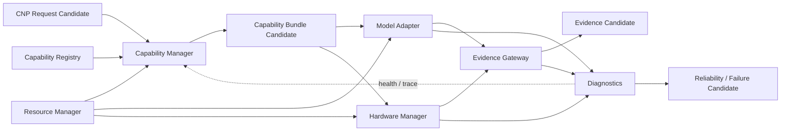

# Capability Middleware Module Map v1

## Module responsibilities

| Module | Responsibility | Inputs | Outputs | Explicitly prohibited |
|---|---|---|---|---|
| Capability Registry | Describes capability classes, providers, lifecycle, constraints, version metadata | registry metadata; provider declarations | capability availability candidate | Goal/attention/decision ownership |
| Capability Manager | Matches admitted information needs to feasible capability-bundle candidates | CNP request; registry; resource/lifecycle candidates | capability bundle / feasibility candidate | Direct cognitive selection or model execution |
| Model Adapter | Normalizes provider-specific model I/O | admitted provider request; raw provider output | raw normalized result / adapter reliability candidate | Interpretation as truth or direct decision output |
| Hardware Manager | Abstracts sensor/device availability, access, and lifecycle | sensor/hardware state; admitted request | hardware availability / raw signal / health candidate | Goal creation, route planning, action authority |
| Resource Manager | Reports and constrains compute, battery, storage, network, and model availability | device/resource measurements; request requirements | resource state / budget constraint candidate | Cognitive budget authority or goal override |
| Evidence Gateway | Converts normalized capability result into provenance-preserving Evidence Candidate | model/hardware raw result; source/lifecycle/resource metadata | Evidence Candidate, conflict/failure candidate | Truth assertion, context/goal mutation |
| Diagnostics | Records trace, health, latency, reliability, and failure observations | module events and candidate references | diagnostics / reliability / failure candidate | Runtime control or cognitive decision |

## Internal relation map

## Composition rule

Capability Manager may compose alternatives such as `visual + OCR`, `audio + ASR`, or `spatial + IMU`, but only as Capability Bundle Candidates. It cannot decide which world interpretation is correct, request unlimited resources, or start a capability without a future approved Runtime Admission boundary.

## Existing-asset alignment

- Existing Model Manager and Capability Registry are candidate sources for Capability Registry/Manager.
- Existing OCR, detection, segmentation, SLAM, ASR, and capture adapters are candidate sources for Model Adapter/Hardware Manager.
- Existing OCR evidence packs and model candidate adapters are migration candidates for Evidence Gateway.
- Existing Model Test Lens can serve Diagnostics/Cognitive Whitebox observability, not Middleware authority.

## Status

`CAPABILITY_MIDDLEWARE_MODULE_MAP_READY_WITH_NOTES`

`WAITING_FOR_USER_TERMINAL_VERIFICATION`
