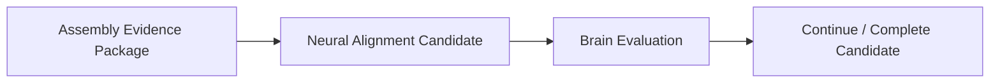

# Assembly Completion Evaluation Model v1

Assembly reports coverage, conflict, unknowns, and partial evidence only.

Assembly, Middleware, and Provider cannot declare cognitive completion. A package with text and spatial coverage but unknown risk remains a partial cognitive output.
