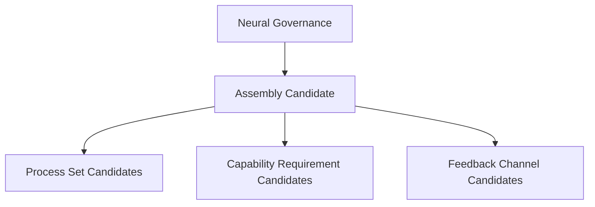

# Cognitive Assembly Contract Model v1

Cognitive Assembly is a bounded cognitive organization unit formed by Neural Governance. It aggregates Process candidates, capability requirements, a cognitive resource profile, feedback channels, and lifecycle state.

Assembly is not an Agent, Task, or Process. It owns no Goal, Personality, Memory, Truth Authority, Decision Authority, Action Authority, or State Mutation Authority.

