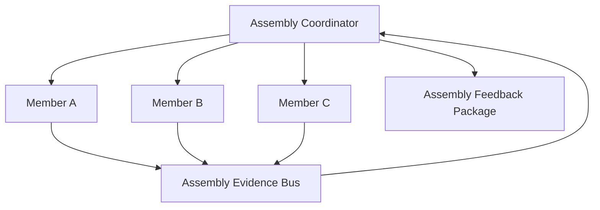

# Cognitive Assembly Coordination Model v1

Members do not privately negotiate. All member contribution, relation metadata, and feedback pass through the Coordinator/Evidence Bus structure. The Coordinator is a routing and structure-maintenance contract only: not an Agent, Goal holder, Decision Maker, Scheduler, Provider caller, or State mutation authority.
