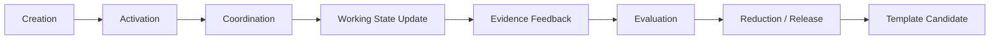

# Assembly Final Lifecycle Reconciliation v1

```mermaid
flowchart LR
 C[Creation] --> A[Activation] --> O[Coordination] --> W[Working State Update]
 W --> E[Evidence Feedback] --> V[Evaluation] --> R[Reduction / Release] --> T[Template Candidate]
```

Template is not Runtime State. Experience is not historical replay. Every transition is a bounded candidate and remains Reducer-free.
