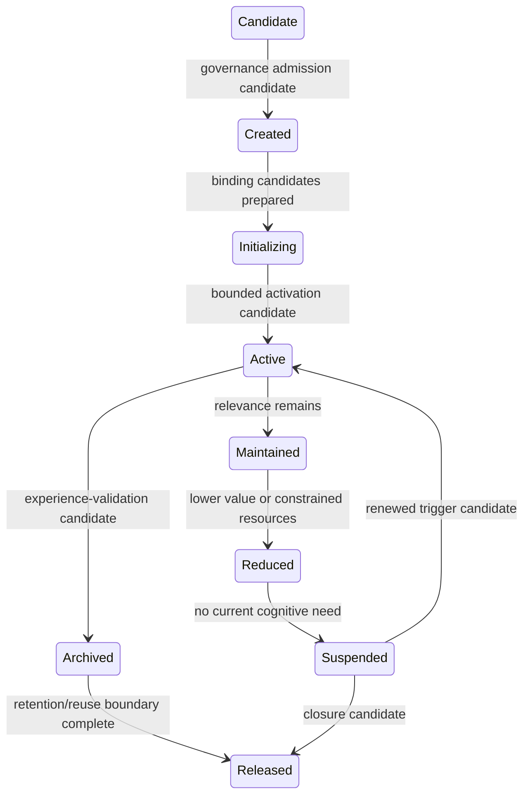

# Cognitive Assembly Lifecycle Model v1

Goal completion, timeout, resource reclamation, and failure replacement are closure/replacement signals only. They do not auto-mutate State or create a replacement Assembly.
