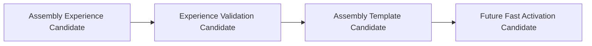

# Cognitive Assembly Recovery and Template Reuse Model v1

A template may retain typical processes, required capabilities, failure patterns, and resource profiles. It must not copy historical Runtime state, directly activate an Assembly, override current Evidence, or modify Brain/Neural/Middleware state.
