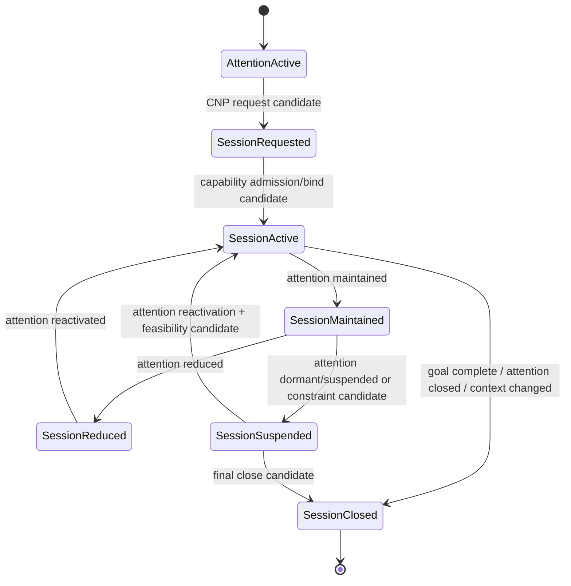

# Attention–Capability Session Integration v1

## Core rule

Attention lifecycle governs the cognitive relevance of a Capability Session. Session lifetime is not a fixed TTL and is not determined by a provider merely remaining available.

## Lifecycle alignment

| Attention lifecycle candidate | Capability Session treatment | Who initiates | Middleware authority limit |
|---|---|---|---|
| `active` | Create/request or maintain active bounded evidence session | Brain Attention Controller through CNP request candidate | Resolve feasibility only; cannot broaden goal/scope autonomously |
| `maintained` | Keep session binding; reduce immediate collection intensity or await task-relevant update | Brain candidate | May report cost/health constraints |
| `background` | Maintain low-cost health/availability awareness only when explicitly justified | Brain candidate plus bounded Middleware diagnostics | Cannot create unlimited background observation |
| `reduced` | Reduce requested cadence, depth, evidence scope, or bundle complexity | Brain allocation adjustment candidate | May propose constrained alternative bundle |
| `dormant` | Suspend active collection while preserving a reversible session reference candidate | Brain candidate | Provider availability remains reportable, not cognitively active |
| `suspended` | Pause session because Brain or constraint candidate requires it | Brain closure/suspend candidate or Middleware constraint candidate | Middleware may stop unsafe/unavailable provider activity, but does not close cognitive intent |
| `closed` | Close session and emit closure/trace/constraint candidate | Brain attention release, goal completion, context change, or future Runtime closure process | Cannot turn closure into memory or experience mutation |

## Dual closure boundary

There are two different closure causes:

1. **Cognitive closure:** Goal completed, Attention released, Context changed, or sufficiency accepted. The Brain originates a close candidate.
2. **Protective/provider suspension:** resource limit, hardware safety event, provider failure, or lifecycle retirement. Middleware emits a suspend/constraint/failure candidate; a local device may protect itself, but the Brain retains responsibility for cognitive reallocation or final goal-level closure.

## Integration flow

## Forbidden shortcuts

- Provider availability → active attention;
- Capability Session → new Goal;
- Session expiry → automatic cognitive forgetting;
- hardware protection → cognitive decision;
- evidence stream → action.

## Status

`COGNITIVE_ATTENTION_CAPABILITY_SESSION_INTEGRATION_READY_WITH_NOTES`

`WAITING_FOR_USER_TERMINAL_VERIFICATION`
