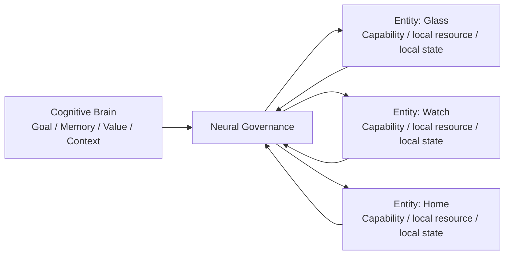

# Cognitive Brain–Entity Relationship Model v1

## Relationship

One Cognitive Brain is the cognitive subject boundary. Multiple Entities are its bounded embodiment nodes. The relationship is not parent-agent to child-agent; it is cognitive ownership to distributed capability embodiment.

## Ownership table

| Concern | Brain | Entity |
|---|---|---|
| Goal / value / cognitive purpose | Owns candidate formation and evaluation boundary. | Cannot create, modify, or replace. |
| Long-term Memory / Experience | Owns governed representation/evolution boundary. | May hold bounded local cache only. |
| Context / Workspace / Simulation | Owns cognitive use and update candidates. | May report local conditions/evidence only. |
| Local capability / resource / health | Receives candidates. | Owns local reporting and safety-protection boundary. |
| Execution organization | Sets why/what through Neural/CWO. | Local Middleware organizes capability execution candidate. |

## Local state boundary

An Entity may have local connection, health, resource, and capability-session state. Such state is not Brain Self State, not Memory, and not a separate cognitive snapshot. It returns only as State/Evidence/Failure candidates through the approved Entity–Neural path.
