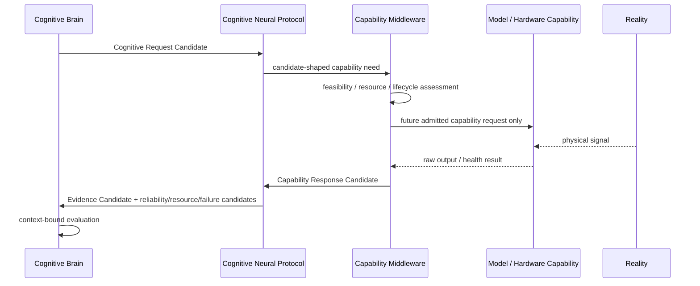

# Cognitive Brain–Middleware Boundary v1

## Boundary statement

The Cognitive Brain owns cognitive direction. Cognitive Middleware owns controlled capability provision. External models and hardware execute only within an admitted capability boundary. Reality remains outside all Luna-internal authority.

## Responsibility matrix

| Responsibility | Cognitive Brain | Cognitive Middleware | External model / hardware |
|---|---|---|---|
| Current context | Owns candidate formation and revision | Receives contextual constraints only | Does not interpret context as goal |
| Goal | Owns Active Goal Candidate | Receives goal context only for capability relevance | Does not create or override goal |
| Attention / information need | Owns Attention Candidate Pool and allocation candidate | Applies admitted request constraints; cannot allocate cognitive attention | May produce raw signals only |
| Cognitive request | Produces Cognitive Request Candidate | Validates feasibility and prepares capability response candidate | Executes only when a future approved boundary permits |
| Capability discovery | Requests a needed capability class | Owns registry lookup and provider availability | Advertises available function/health |
| Capability selection | Defines cognitive need and constraints | Proposes feasible capability bundle candidate | Does not self-select as cognitive authority |
| Resource allocation | Supplies cognitive budget need candidate | Measures/proposes compute, battery, storage, network, lifecycle constraints | Exposes device/model resource facts or estimates |
| Evidence packaging | Consumes Evidence Candidate | Owns source/provenance/scope/uncertainty packaging | Produces raw output only |
| Evaluation | Owns applicability, consistency, risk, and sufficiency candidates | May diagnose delivery/reliability; cannot judge truth | No cognitive evaluation authority |
| Decision / action | Not owned by this A-route layer; only Decision Support Candidate | Forbidden | Forbidden unless future executor authorization exists |

## Frozen prohibitions

Middleware must not possess:

- Decision Authority;
- Goal Authority;
- Attention Authority;
- Truth Authority;
- direct Cognitive State mutation authority;
- direct action/execution authority.

The Brain must not:

- call a camera, model, or hardware driver directly;
- assume an available capability was executed;
- treat an Evidence Candidate as fact;
- bypass Cognitive Neural Protocol.

## Boundary flow

## Status

`COGNITIVE_BRAIN_MIDDLEWARE_BOUNDARY_READY_WITH_NOTES`

`WAITING_FOR_USER_TERMINAL_VERIFICATION`
