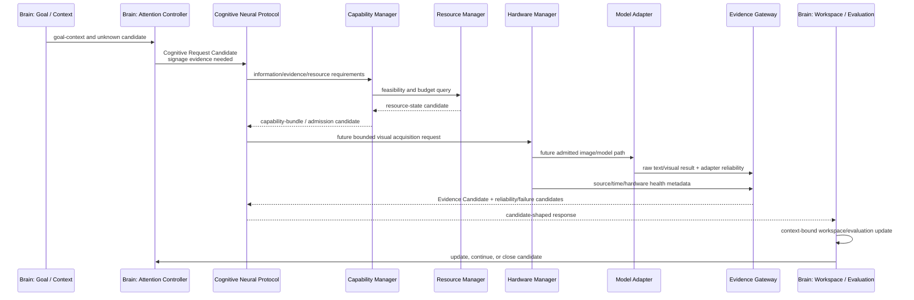

# Brain–Middleware Interaction Sequence v1

## Navigation example

Scenario: Luna is assisting with navigation. The active goal is to reach an airport gate. Attention identifies a high-value information gap: current forward route signage is unknown.

## Interaction constraints

| Step | Allowed | Forbidden |
|---|---|---|
| Goal/Attention → CNP | State what evidence is needed, required freshness/scope, priority, confidence requirement | Direct camera/model invocation |
| Capability Manager resolution | Propose provider/bundle feasibility | Create task/goal or choose cognitive priority |
| Resource Manager response | Report budget/availability/degradation | Override Goal or Attention |
| Hardware/Model handling | Collect/normalize raw capability output in a future approved runtime | Produce fact, route plan, decision, or action |
| Evidence Gateway return | Return Evidence Candidate plus reliability/resource/failure candidates | Confirm truth, update context, direct action |
| Brain update | Evaluate evidence and issue update/close candidates | Treat successful delivery as reality confirmation |

## Capability Manager–Attention Controller relationship

The relationship is intentionally one-directional in cognitive authority:

`Attention Controller → information need candidate → Capability Manager → feasible capability candidate → Brain`

Capability availability can constrain a request, but it cannot cause a new Brain task, create a new Attention target, or proactively recommend a task solely because a provider exists.

## Status

`COGNITIVE_BRAIN_MIDDLEWARE_INTERACTION_SEQUENCE_READY_WITH_NOTES`

`WAITING_FOR_USER_TERMINAL_VERIFICATION`
