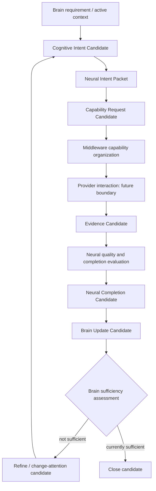

# Cognitive Brain–Neural Intent Feedback Loop v1

## Purpose

This loop keeps information acquisition iterative and candidate-based. The Brain can refine information needs after receiving bounded evidence feedback, without a direct model-to-decision path.

## Candidate outcomes

| Outcome | Meaning | Authority boundary |
|---|---|---|
| `continue_candidate` | The evidence gap remains relevant; retain or reissue a bounded requirement. | Does not execute a capability. |
| `refine_candidate` | Narrow, clarify, or alter the information/relationship requirement. | Does not change a goal. |
| `change_attention_candidate` | Propose a new allocation or focus bias. | Must re-enter Attention Governance. |
| `close_candidate` | Propose closure of this information-request lifecycle. | Does not delete memory or assert truth. |

## Feedback discipline

1. Every feedback item retains trace/provenance to the intent and evidence candidates.
2. Evidence conflict remains represented as a conflict candidate.
3. A capability failure returns a failure candidate and may trigger refinement; it does not invalidate the active goal by itself.
4. Resource constraints may narrow or defer a request, but do not grant Middleware goal or attention authority.
5. No loop edge emits a Decision Candidate, Action Candidate, or Runtime State Mutation.

## Runtime status

This is an architectural interaction model only. Provider interaction is a future admitted boundary; no capability session, provider invocation, model connection, or runtime loop is implemented by this phase.
