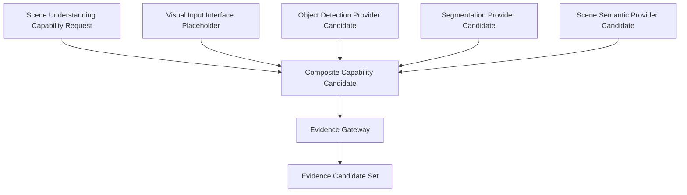

# Capability Composition Model v1

## Purpose

A Sense Capability may require multiple Providers. Composition is the governed formation of a **Composite Capability Candidate**, not simple parallel model output stitching and not an execution plan.

## Scene Understanding example

## Composition rules

| Composition concern | Required behavior | Prohibited behavior |
|---|---|---|
| Capability intent | derived from Brain/Neural Capability Signal | provider-driven task creation |
| Provider roles | each provider has declared input/output/scope/resource/reliability role | anonymous result merging |
| Input | visual/audio/etc. input is represented as an interface requirement | hardware-system implementation in this phase |
| Fusion boundary | raw provider results enter Evidence Gateway with provenance | direct context/decision/action output |
| Failure/degradation | individual provider failure is explicit in composite candidate | silent substitution or false certainty |
| Resource | composition respects resource constraints and may offer alternatives | unlimited parallel invocation |

## Composition outcome

`Composite Capability Candidate → Evidence Gateway → Evidence Candidate Set → Neural Evidence Signal → Brain`

This avoids the old pattern `image → multiple models → implicit result stitching`. The capability purpose, provider role, and evidence provenance remain visible.

## Status

`COGNITIVE_CAPABILITY_COMPOSITION_MODEL_READY_WITH_NOTES`

`WAITING_FOR_USER_TERMINAL_VERIFICATION`
