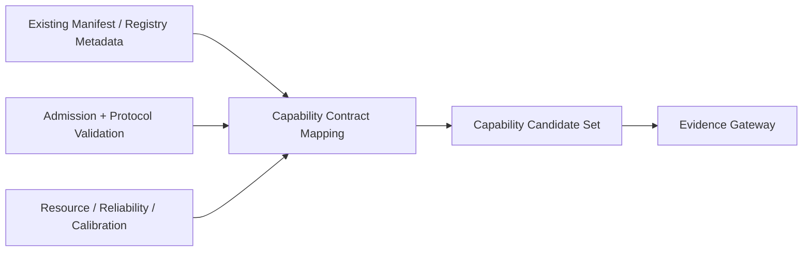

# Cognitive Capability Contract v2

## Purpose

Capability Contract v2 is a conceptual mapping envelope for the existing registry manifest, admission, lifecycle, provider profile, adapter, resource, and evidence assets. It is not a new runtime schema or a replacement for `capability_module_manifest_schema_v1.json`.

## Required declaration groups

| Group | Required declarations | Existing governance alignment |
|---|---|---|
| Identity | `capability_id`, `version`, `provider` | Capability Registry, manifest, provider registry |
| Input | `input_type`, `evidence_requirement` | input contract, adapter contract, CNP request constraint |
| Output | `output_type`, `evidence_candidate` | output contract, output candidate governance, Evidence Gateway |
| Resource | `compute_cost`, `memory_cost`, `latency` | runtime resource profile, Resource Manager, health diagnostics |
| Reliability | `confidence`, `calibration` | provider profile, health diagnostics, baseline/calibration governance |
| Boundary | `allowed_scope`, `forbidden_scope` | admission policy, protocol compatibility, manifest constraints |

## Contract invariant

## Boundary declarations

Every mapped capability must make explicit:

- provider identity and lifecycle reference;
- permitted modality/scope and prohibited outputs;
- whether output can be packaged only as evidence;
- resource/reliability/calibration references;
- trace/replay/diagnostic references where they exist;
- no Goal, Attention, Truth, Decision, Action, Permission, or State mutation authority.

## Status

`COGNITIVE_CAPABILITY_CONTRACT_V2_READY_WITH_NOTES`

`WAITING_FOR_USER_TERMINAL_VERIFICATION`
