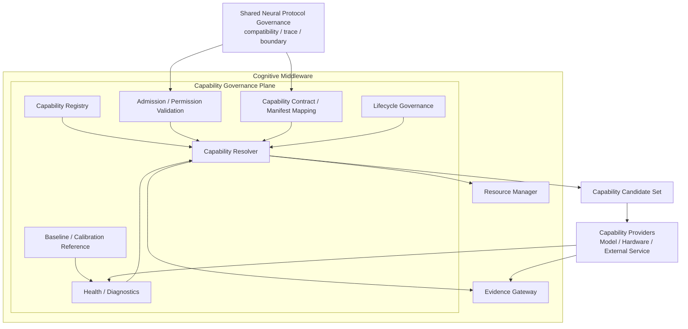

# Cognitive Capability Governance Architecture v2

## Position

Capability Governance Plane belongs to **Cognitive Middleware**. It governs which registered capability/provider can be admitted, described, calibrated, resolved, observed, degraded, or retired. It does not own Goal, Attention, Decision, Truth, Action, or State mutation.

Shared generic Protocol Governance remains under the Cognitive Neural/Governance boundary. The Middleware plane consumes its compatibility/admission/trace contracts; it does not create a second Protocol Manager.

## Plane responsibilities

| Plane concern | Reused asset class | Result form |
|---|---|---|
| Registry | Canonical Capability Registry | registered capability/provider metadata candidate |
| Admission | Model/Skill/Permission admission contracts | admission/constraint/failure candidate |
| Contract/Manifest | manifests, schemas, adapter/profile references | contract compatibility candidate |
| Baseline/Calibration | baseline registry and recalibration assets | diagnostic/calibration reference candidate |
| Lifecycle | lifecycle registry and provider lifecycle governance | availability/degradation/retirement candidate |
| Health/Diagnostics | manager diagnostics, trace/replay | reliability/resource/failure candidate |
| Resolver | model/provider routing inputs plus resource constraints | Capability Candidate Set |

## Authority boundary

- Brain/Neural signals state what information is needed.
- Capability Governance Plane states what registered/admitted/feasible capability alternatives exist.
- Provider execution is future Runtime Admission work.
- Evidence Gateway is the only cognition-facing output boundary.

## Status

`COGNITIVE_CAPABILITY_GOVERNANCE_ARCHITECTURE_V2_READY_WITH_NOTES`

`WAITING_FOR_USER_TERMINAL_VERIFICATION`
