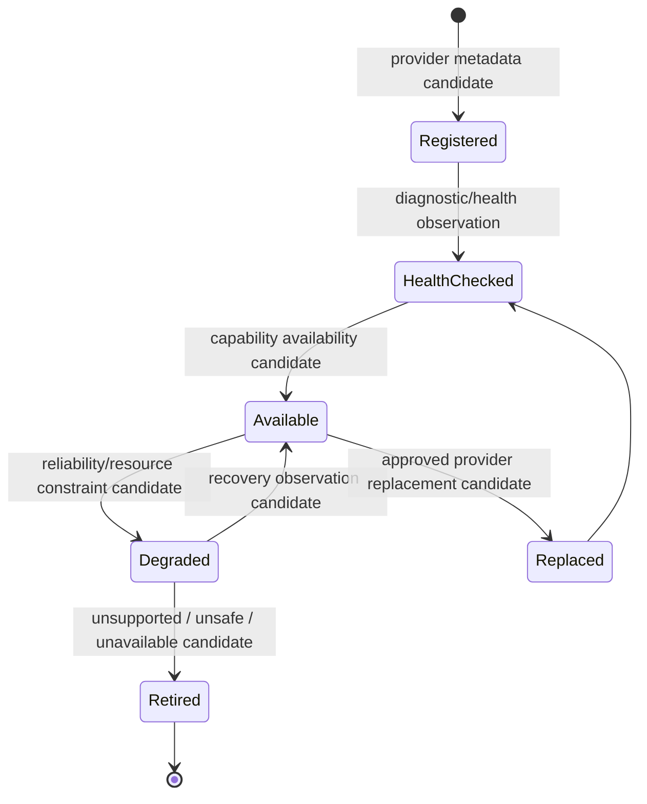

# Cognitive Capability Lifecycle Model v1

## Scope

Capability lifecycle governs a capability provider's availability and safe operability. It does not govern cognitive learning, Goal formation, Attention allocation, or Decision.

## Lifecycle

| Lifecycle stage | Middleware responsibility | Brain-visible output | Prohibited result |
|---|---|---|---|
| Register | record capability class, provider metadata, version and constraints | capability metadata candidate | automatic cognitive adoption |
| Health check | observe model/device availability, latency, errors, safety/reliability status | reliability state candidate | truth or evaluation judgment |
| Available | expose feasible capability availability | capability available candidate | automatic task creation or invocation |
| Degrade | mark bounded reduction in quality/availability/resource feasibility | constraint / failure candidate | silent evidence-quality upgrade or Goal override |
| Replace | propose/record provider alternative within governance | provider replacement candidate | change Brain boundary or semantics without review |
| Retire | remove capability from future availability candidate set | unavailable candidate | deletion of past evidence/traces/experience |

## Lifecycle-to-session relationship

A Capability Session binds only to a capability that is currently Available or conditionally feasible. A later Degraded or Retired candidate triggers a session update/closure candidate; it does not alter the Brain's past interpretation, mutate State, or choose a new Goal.

## Status

`COGNITIVE_CAPABILITY_LIFECYCLE_MODEL_READY_WITH_NOTES`

`WAITING_FOR_USER_TERMINAL_VERIFICATION`
