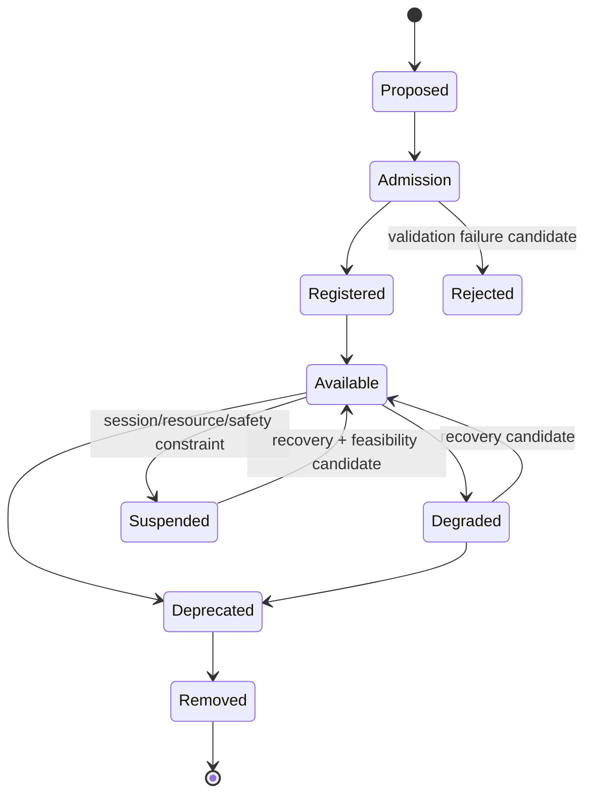

# Capability Lifecycle Reconciliation v1

## Reconciliation principle

Lifecycle governance belongs to Cognitive Middleware Capability Governance Plane and reuses `luna_capability_lifecycle_registry_v1.json` plus existing Model Admission Governance lifecycle rules. This document does not replace the canonical lifecycle registry.

## Target conceptual lifecycle and existing mapping

| Target concept | Existing asset/status relationship | Meaning |
|---|---|---|
| Proposed | planning/admission request candidate before registry entry | Capability/provider is under governance consideration. |
| Admission | Model/Skill/Permission/Protocol contract validation | Entry eligibility is evaluated; not runtime enable. |
| Registered | canonical Capability Registry + manifest reference | Governance metadata is recorded. |
| Available | existing `integration_ready`, `functional_module_ready`, or disclosed `degraded` callable condition, subject to resource/health | May appear in Capability Candidate Set; not invoked automatically. |
| Degraded | existing `degraded` lifecycle status or provider health degradation candidate | Must disclose limitations and may constrain Resolver. |
| Suspended | session/provider availability constraint candidate; not a new registry lifecycle by default | Temporarily unavailable for a session or safety/resource reason. |
| Deprecated | existing `deprecated` lifecycle status | Compatibility reads may remain; new dependents are disallowed. |
| Removed | existing `retired` lifecycle status | Not callable and invocation is disallowed. |

## Lifecycle boundary

- Registry lifecycle governs module/provider governance status.
- Capability Session lifecycle governs one bounded evidence-use relationship.
- The latter must not create duplicate lifecycle statuses in the canonical Registry.
- Lifecycle state controls feasibility candidates, not Brain Goal/Attention authority.

## Status

`COGNITIVE_CAPABILITY_LIFECYCLE_RECONCILIATION_READY_WITH_NOTES`

`WAITING_FOR_USER_TERMINAL_VERIFICATION`
