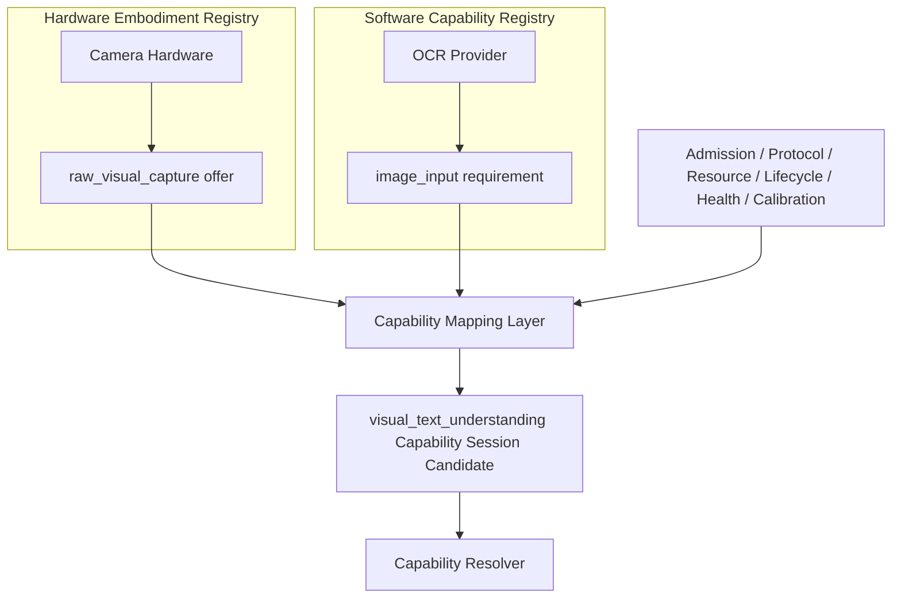

# Cognitive Capability Mapping Layer v1

## Purpose

Capability Mapping Layer is the single architectural relation point between the independent Software Capability Registry and Hardware Embodiment Registry. It prevents both registries from becoming parallel databases with direct cross-layer authority.

## Mapping responsibility

| Input | Mapping question | Output |
|---|---|---|
| Hardware registry entry | What raw capability can this device/body offer now? | hardware offer candidate |
| Software registry entry | What input/output/scope/resource/reliability contract does this provider require? | software requirement candidate |
| Governance constraints | Is the pairing admitted, compatible, feasible, healthy, and calibrated enough? | mapping feasibility/constraint candidate |
| Capability need | Does this pairing support the requested Sense Domain/Capability? | Capability Session Candidate input |

## Forbidden authority

- Software Registry cannot power, wake, configure, or otherwise control Hardware.
- Hardware Registry cannot create Brain Goal, Attention, Context, or Self State.
- Mapping cannot execute a provider, allocate Attention, judge truth, or mutate State.
- Mapping result is not a Capability Session execution; it is an input candidate for Resolver and future Runtime Admission.

## State feedback path

All hardware state uses the fixed path:

`Hardware Protocol → Hardware Registry → Middleware → Neural State Signal → Brain Self State`

No direct hardware-to-Brain state update is valid.

## Status

`COGNITIVE_CAPABILITY_MAPPING_LAYER_READY_WITH_NOTES`

`WAITING_FOR_USER_TERMINAL_VERIFICATION`
