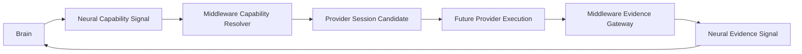

# Capability–Neural Boundary v1

## Separation

The Neural Layer governs signal transport, type, compatibility, trace, and authority envelope. Cognitive Middleware governs capability resolution, provider management, resource evaluation, and evidence packaging. Providers execute bounded capability only in a future admitted runtime.

| Layer | Responsible for | Must not do |
|---|---|---|
| Neural | Capability Signal, request transport, protocol compatibility/version/trace | resolve provider, allocate resources, execute provider, evaluate truth |
| Middleware | Capability resolution, provider management, Resource evaluation, Evidence packaging | create Goal/Attention, change protocol authority, decide/action |
| Provider | future bounded execution, raw output, local health | emit cognitive fact, modify context/goal, select itself |

## Boundary rule

Neural transport does not turn a cognitive request into a provider command. Middleware resolution does not turn a provider candidate into execution. Provider output does not turn into cognitive evidence until Evidence Gateway packages it and Neural Layer transports it with provenance/uncertainty/trace.

## Status

`COGNITIVE_CAPABILITY_NEURAL_BOUNDARY_READY_WITH_NOTES`

`WAITING_FOR_USER_TERMINAL_VERIFICATION`
