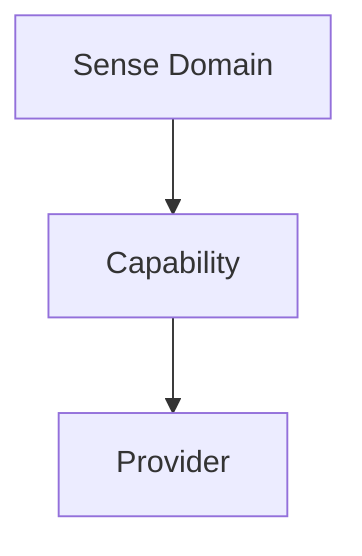

# Cognitive Capability–Provider Hierarchy v1

## Three-level abstraction

| Level | Question | Ownership | Example | Not responsible for |
|---|---|---|---|---|
| Sense Domain | What class of embodied information is involved? | Middleware Embodiment Governance classification | Vision | model selection or cognitive decision |
| Capability | What evidence/understanding operation is needed? | Brain request + Middleware Capability Governance | Text Understanding | specific provider execution |
| Provider | Which concrete model/device/service could provide the operation? | Middleware Provider Management | RapidOCR, PaddleOCR, VLM | Goal, Attention, Truth, Decision |

## Request and resolution flow

`Brain information need → Neural Capability Signal → Sense Domain / Capability classification → Provider Candidate Set → future Provider Session → Evidence Candidate`

## Frozen rules

- Brain requests Capability, not Provider.
- Middleware selects/proposes Provider Candidates, not final cognitive answers.
- Provider produces raw output/health; Evidence Gateway produces Evidence Candidate.
- A Provider may support multiple capabilities; a Capability may have multiple providers.
- Capability availability does not activate Attention or a session by itself.

## Status

`COGNITIVE_CAPABILITY_PROVIDER_HIERARCHY_READY_WITH_NOTES`

`WAITING_FOR_USER_TERMINAL_VERIFICATION`
