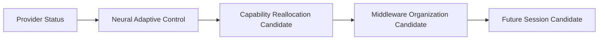

# Capability Reallocation Candidate Model v1

`capability_reallocation_candidate` translates a Neural adaptive-control candidate into a bounded capability-level reorganization request.

Required fields: `reallocation_id`, `source_provider_status`, `trigger_reason`, `current_capability`, `capability_gap`, `requested_capability_change`, `alternative_capability_candidate`, `priority_candidate`, `resource_constraint`, and trace.

It is not a Task, Decision, Action, Scheduler instruction, Provider selection, or session execution request.

