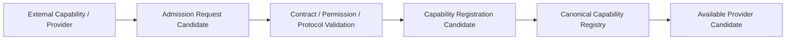

# Capability Registry and Admission Relationship v1

## Distinct responsibilities

| Concept | Question answered | Existing source | Is not |
|---|---|---|---|
| Capability Registry | What capability modules/providers/metadata does Luna know about? | `luna_capability_registry_v1.json` and provider registries | proof a provider is admitted or invoked |
| Admission | May a proposed capability/provider/skill enter the governed system surface? | Model Admission Governance; Permission/Admission Manager; Model/Skill mapping | runtime invocation |
| Registration | Has an admitted governed capability been recorded in the canonical registry? | Capability Registry + manifest/lifecycle references | a decision to call it |
| Availability | Is a registered capability currently feasible/healthy under lifecycle/resource conditions? | lifecycle, diagnostics, resource/health assets | automatic task/attention activation |

## Required chain

## Frozen rules

- Registration ≠ Admission.
- Admission ≠ Runtime enable.
- Runtime enable ≠ Invocation.
- Provider availability ≠ Brain information need.
- Registry metadata ≠ Attention Authority.

The existing model-admission governance already requires shared lifecycle, license/source gate, adapter contract, provider admission, runtime governance, output candidate contract, and dry-run lifecycle. The existing Model/Skill contract mapping explicitly states `model_admitted = false`, `skill_admitted = false`, and `runtime_admitted = false` until the governed chain is satisfied. This phase reuses those distinctions.

## Status

`COGNITIVE_CAPABILITY_REGISTRY_ADMISSION_RELATIONSHIP_READY_WITH_NOTES`

`WAITING_FOR_USER_TERMINAL_VERIFICATION`
