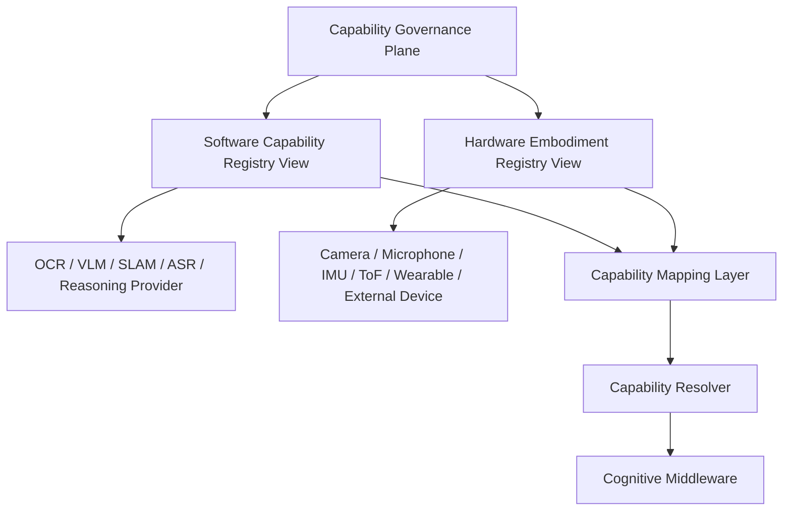

# Cognitive Capability Registry Architecture v3

## Purpose

Registry v3 is an architectural separation of existing governance assets into two namespaces: **Software Capability Registry** and **Hardware Embodiment Registry**. It does not create a new registry implementation or replace the canonical `luna_capability_registry_v1.json`.

## Registry and Capability Mapping split

Software and Hardware Registry views are independent governance namespaces, not two parallel databases that independently control Luna. They converge only through a separate **Capability Mapping Layer**, which tests whether a hardware raw capability offer can satisfy a software capability input requirement under admission, protocol, resource, lifecycle, and reliability constraints.

## Software Capability Registry view

| Field | Meaning | Existing asset alignment |
|---|---|---|
| `capability_id` | governed ability identity, not merely model id | canonical Capability Registry |
| `version` | capability/module or provider profile version | manifest / lifecycle metadata |
| `provider` | provider candidate(s) that may satisfy capability | Model Manager provider registry |
| `input` | allowed modality/input contract | manifest / adapter contract |
| `output` | candidate output/evidence type | output contract / Evidence Gateway |
| `resource` | compute/memory/latency/network traits | resource profile / diagnostics |
| `reliability` | health, confidence, calibration/reference condition | diagnostics / baseline/calibration assets |

## Hardware Embodiment Registry view

| Field | Meaning | Existing asset alignment |
|---|---|---|
| `device_id` | device/profile identity | Hardware Profile Capability Registry schema |
| `device_type` | camera, microphone, IMU, ToF, wearable, external device | sensor/device registry schema planning |
| `manufacturer` | hardware provenance | future profile metadata; not assumed present |
| `firmware` | firmware/version identity | future profile metadata; no runtime assertion |
| `protocol` | hardware protocol/adapter contract reference | Hardware Camera Control/Adapter contracts |
| `capability_offer` | device-supplied capability classes | Hardware Profile Capability Registry status schema |
| `power_state` | power/sleep/wake condition candidate | Hardware Protocol telemetry/state signal |
| `health_state` | availability/degradation/permission/error condition | existing hardware status/health taxonomy |
| `battery_state` | energy condition candidate | device status feedback / resource state |

## Capability Mapping Layer

| Mapping input | Meaning | Output |
|---|---|---|
| Hardware Capability Offer | what an embodiment/device can supply as raw capability, for example `visual_capture` | compatible raw-input candidate |
| Software Capability Requirement | what a software capability/provider needs, for example `image_input` | compatible processing-requirement candidate |
| Governance constraints | admission, protocol compatibility, resource, lifecycle, health, calibration, scope | mapping feasibility / constraint candidate |
| Mapping result | hardware + software compatibility relationship | Capability Session Candidate input, never an execution command |

Example:

`Camera Hardware offers visual_capture + OCR Software requires image_input → visual_text_understanding Capability Session Candidate`

The mapping does not allow Software Registry to control hardware or Hardware Registry to influence Brain directly. It only establishes whether a governed embodiment/software combination can be offered to Capability Resolver.

## Registry invariants

- Software and hardware entries remain distinct; only Capability Mapping may relate them for one Capability Candidate Set.
- A model is a provider under a software capability; a camera is a device/provider under an embodiment offer.
- Registration, admission, availability, and invocation remain separate.
- No registry entry gains Goal, Attention, Truth, Decision, Action, or State-mutation authority.
- Hardware state must follow `Hardware Protocol → Hardware Registry → Middleware → Neural State Signal → Brain Self State`.
- Existing canonical Registry and hardware-profile planning assets are reused through future mapping; no parallel registry is created by this phase.

## Status

`COGNITIVE_CAPABILITY_REGISTRY_ARCHITECTURE_V3_READY_WITH_NOTES`

`WAITING_FOR_USER_TERMINAL_VERIFICATION`
