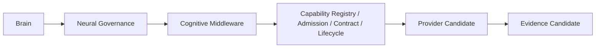

# Capability Registry Reintegration Model v1

## Baseline decision

The existing `capabilities/registry/luna_capability_registry_v1.json`, lifecycle registry, manifests, baseline registry, admission assets, and protocol governance remain canonical governance assets. This reintegration creates no duplicate Registry.

## Reconciled roles

| Existing asset | Reintegrated role | Restriction |
|---|---|---|
| Capability Registry | Software Capability Registry source and module identity record. | Brain does not access it directly. |
| Manifest | Capability/provider contract evidence and versioned metadata. | Manifest does not invoke a provider. |
| Admission governance | Eligibility for Provider participation. | Admission ≠ execution. |
| Lifecycle registry | Available/degraded/suspended/deprecated policy source. | Lifecycle ≠ Provider Session lifecycle. |
| Baseline/calibration | Engineering governance, diagnostics, anomaly calibration. | Never a normal runtime cognitive input. |
| Protocol Manager | Shared compatibility/trace/change-governance dependency. | Not owned or duplicated by Middleware. |

## Required path

`Brain → Neural → Middleware → Registry/Admission → Provider Candidate`

The Brain exposes only cognitive intent/CWO-derived requirements. Middleware performs Registry querying and Provider feasibility organization under contract, lifecycle, resource, and admission constraints. Registry records cannot generate Goals, Attention, tasks, or direct Provider execution.
