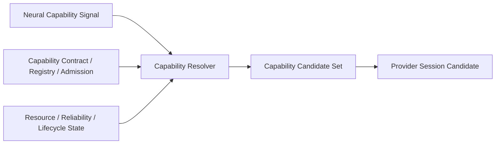

# Capability Resolver Boundary v1

## Definition

Capability Resolver is a Cognitive Middleware governance function. It evaluates registered/admitted capability alternatives against a Brain-originated information need, a Neural Capability Signal, Capability Contract mappings, and current resource/reliability/lifecycle constraints. Its output is a **Capability Candidate Set**.

## Resolution flow

## Inputs and output

| Input | Resolver use | Boundary |
|---|---|---|
| Brain Request / Neural Capability Signal | Required evidence type, scope, priority, duration, resource constraints | Resolver cannot reinterpret it as a new Goal. |
| Capability Registry | known capability/provider candidates | Registry does not imply invocation. |
| Admission / Contract validation | allowed scope, protocol compatibility, provider eligibility | Admission does not imply execution. |
| Resource State | compute/memory/latency/network/energy constraint | Constraint cannot silently change Attention. |
| Health / Lifecycle state | available/degraded/suspended/deprecated condition | Cannot hide degradation or promote provider output to fact. |

| Output | Meaning |
|---|---|
| Capability Candidate Set | ordered or alternative candidate bundles with explicit resource/reliability/scope constraints |
| Provider Session Candidate | conceptual binding candidate only; future runtime admission is separately required |
| Failure / Constraint Candidate | no feasible provider, incompatible contract, unavailable lifecycle, or insufficient resource |

## Forbidden

Resolver cannot:

- decide a Goal;
- determine or allocate Attention;
- directly execute a model/provider;
- produce evidence or truth;
- mutate State;
- start an unrequested background observation path.

## Status

`COGNITIVE_CAPABILITY_RESOLVER_BOUNDARY_READY_WITH_NOTES`

`WAITING_FOR_USER_TERMINAL_VERIFICATION`
