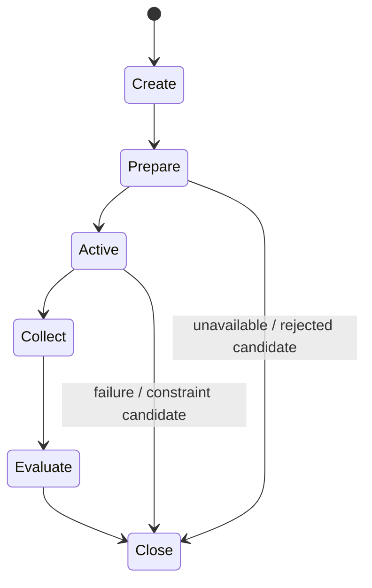

# Capability Session Contract v1

## Definition

A Capability Session is the bounded lifecycle contract for serving one CWO-derived capability requirement. It is not a generic API call, task plan, cognitive state, or autonomous execution loop.

## Lifecycle stages

| Stage | Contract meaning | Forbidden effect |
|---|---|---|
| Create | Establish session candidate from a Capability Execution Candidate. | Does not invoke Provider. |
| Prepare | Validate admission, protocol, provider, resource, and expected-evidence prerequisites. | Does not alter CWO purpose. |
| Active | Future admitted period in which Provider interaction may occur. | Does not give Provider cognitive authority. |
| Collect | Receive bounded Provider output/status into Evidence Adapter/Gateway path. | Does not establish truth. |
| Evaluate | Middleware reports delivery/coverage status; Neural aligns to CWO. | Does not determine cognitive completion. |
| Close | Close this execution-session lifecycle with trace and failure/degradation record. | Does not close a Brain goal or delete memory. |

## Session record

`session_id`, `cwo_ref`, `capability_requirement_ref`, `provider_candidate_ref`, `resource_constraint_ref`, `expected_evidence_contract`, `lifecycle_state`, `failure_policy_ref`, and `trace`.

This phase defines the contract only. It creates no sessions, Scheduler, Runtime, or model calls.
