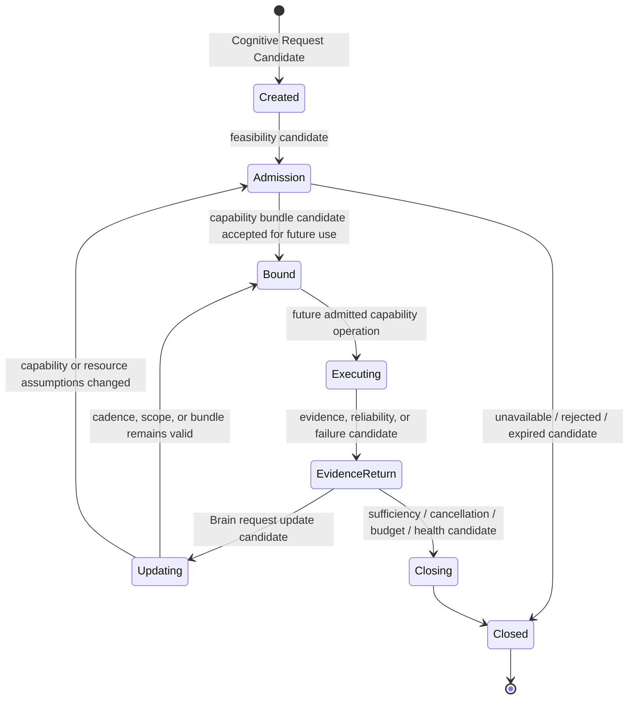

# Cognitive Capability Session Lifecycle v1

## Definition

A Cognitive Capability Session is a bounded, candidate-governed relationship between a Cognitive Request and one or more capability providers. It represents continuing evidence provision, not a direct model call.

## Lifecycle

## Lifecycle semantics

| State | Meaning | Permitted output | Prohibited interpretation |
|---|---|---|---|
| Create | Brain states a bounded information need | session candidate | request is not hardware/model execution |
| Admission | Middleware checks provider/resource/lifecycle feasibility | admission, constraint, or failure candidate | admission is not decision or permission to change reality |
| Bind | A feasible capability bundle is associated with the session | bundle binding candidate | binding is not guaranteed provider success |
| Execute | Future approved capability runtime performs bounded collection | raw provider output / health observation | no current execution is defined by this phase |
| Evidence Return | Gateway packages evidence/reliability/resource/failure information | Capability Response Candidate | evidence is not truth |
| Update | Brain or Middleware constraint changes session scope/cadence/bundle candidate | update candidate | Middleware cannot invent a new cognitive goal |
| Close | Session ends or becomes unavailable | closure / retention / failure candidate | close does not delete memory or create experience automatically |

## Continuous-request model

For navigation, “observe the forward road” is not repeated unrelated API calls. It is one bounded streaming session whose update cadence and relevance are governed by Brain Attention and Middleware resource/health constraints.

`Goal + Attention + information gap → session create → evidence stream → brain evaluation → update / close`

The Brain may request continuation. Middleware may report that continuation is constrained, degraded, unavailable, or unsafe for the device. Neither may convert a session into an autonomous action.

## Session identity and trace requirements

A future session record should carry only candidate references and observability metadata:

- session reference;
- originating Cognitive Request Candidate reference;
- goal/context/attention references;
- bound capability-bundle candidate reference;
- resource/reliability/failure candidate references;
- evidence trace references;
- lifecycle state;
- update and closure reasons.

It must not contain Decision Authority, Action Authority, Truth Authority, or State-mutation permission.

## Status

`COGNITIVE_CAPABILITY_SESSION_LIFECYCLE_READY_WITH_NOTES`

`WAITING_FOR_USER_TERMINAL_VERIFICATION`
