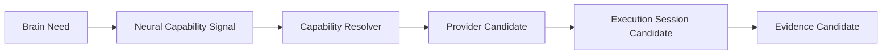

# Capability Whitebox Architecture v1

## Purpose

Capability Whitebox is a future read-only trace projection for explaining capability governance. It should expose why a capability alternative was considered, how admission/resource/lifecycle constraints shaped feasibility, and what evidence returned—not merely “YOLO was called.”

## Required views

| View | Shows | Must not become |
|---|---|---|
| Brain Need | information/evidence requirement, scope, priority, resource constraint | Goal/Attention editing control |
| Neural Capability Signal | source, destination, signal type/version/lifecycle/trace | device command panel |
| Resolver | registered/admitted alternatives, contract/resource/reliability/lifecycle constraints | model-selection decision dashboard |
| Provider Candidate | provider traits and capability fit | confirmation that provider executed |
| Execution Session | future session candidate/bind/health/suspend/close trace | runtime executor/control endpoint |
| Evidence Candidate | source, scope, confidence, uncertainty, reliability, trace | fact confirmation or direct cognitive update |
| Governance / diagnostics | admission/contract/compatibility/lifecycle/replay results | State mutation or action authority |

## Existing Whitebox reuse

Model Test Lens, module diagnostics, trace/replay, and runner-admission views are reusable presentation assets. Their future role is read-only projection of governance candidates. They cannot create/approve admission, invoke providers, alter lifecycle, mutate State, or override Attention.

## Status

`COGNITIVE_CAPABILITY_WHITEBOX_ARCHITECTURE_READY_WITH_NOTES`

`WAITING_FOR_USER_TERMINAL_VERIFICATION`
