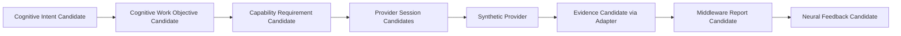

# Controlled Provider Invocation Skeleton Implementation v1

## Phase

`Phase-Cognitive-Controlled-Provider-Invocation-Skeleton-v1-001`  
Execution mode: V1 — controlled skeleton implementation with synthetic Provider only.

## Implemented scope

| Concern | Implementation |
|---|---|
| Neural/CWO | `cognitive/neural/controlled_provider.py` creates synthetic intent, translates immutable CWO, and forms Neural Feedback Candidate. |
| CWO → capability bridge | `cognitive/middleware/provider_adapter.py` creates a Middleware-owned Capability Requirement Candidate. |
| Capability session | `cognitive/middleware/provider_session.py` emits `Create → Prepare → Active → Collect → Close` session candidates. |
| Synthetic Provider | `SyntheticTextProvider` returns deterministic fixture output; no OCR/model/hardware integration. |
| Evidence adapter | `cognitive/evidence/provider_adapter.py` wraps provider output as an Evidence Candidate; `synthetic_provider` is an allowed synthetic source. |
| Middleware report | `MiddlewareReportBuilder` reports coverage/missing/conflict/failure/degradation without cognitive completion. |
| Trace / replay | `cognitive/validation/controlled_provider_invocation_skeleton.py` emits deterministic trace with authority checks/signature. |
| Runner / verifier | `run_controlled_provider_invocation_skeleton_v1.py` and `verify_controlled_provider_invocation_skeleton_result_v1.py`. |

## Explicit exclusions

- No real OCR, VLM, SAM, SLAM, ASR, camera, hardware, or external model invocation.
- No modification to legacy `runtime/main_loop.py`, Model Manager, Task Manager, Registry, or UI.
- No Scheduler, general Runtime, Decision, Action, Truth, Memory mutation, or Reducer mutation.
- No B-route simulation/body-model integration.

## Component validation record

Two deterministic traces were generated and verified. The component verifier checked 30 conditions, including CWO bridge lineage, five-stage session lifecycle, provider-evidence fields, Evidence Gateway route, no cognitive completion in Middleware/Neural, prohibited authorities, and replay signature equality.

Result: `COMPONENT_VALIDATION_PASSED`  
This is a component-level result only; it is not a final phase GO.
