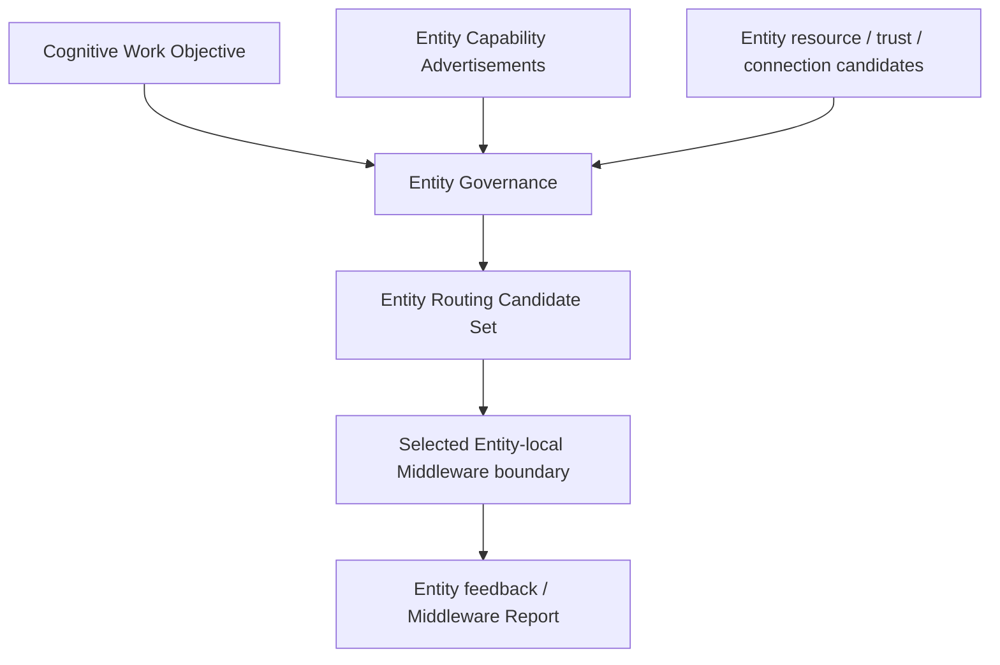

# CWO Entity Routing Model v1

## Purpose

CWO Entity Routing forms an **Entity Routing Candidate** for which embodiment nodes might feasibly host the Middleware organization needed for a CWO. It supports one-brain/multi-body capability distribution without giving Entities authority to alter cognitive work semantics.

## Routing factors

| Factor | Use |
|---|---|
| Capability fit | Whether an Entity advertises roles relevant to CWO evidence/relationship requirements. |
| Resource fit | Local resource and degradation constraints. |
| Availability | Connection and protocol/channel availability. |
| Trust / admission | Whether the Entity is allowed to receive this scoped work candidate. |
| Scope fit | Spatial, temporal, privacy, and embodiment scope compatibility. |
| Collaboration value | Whether multiple entities provide complementary coverage. |

Example: a visual-observation CWO may produce Glass and Badge Entity candidates. It does not authorize either entity to modify the CWO, choose a new goal, execute automatically, or claim exclusive cognitive ownership.

## Authority boundary

Entity Governance produces routing candidates only. Middleware within an admitted Entity retains capability/provider feasibility organization. Neural Governance retains objective supervision. Brain retains cognitive purpose and sufficiency. Entity routing is not an Action, Scheduler, or Runtime assignment.
