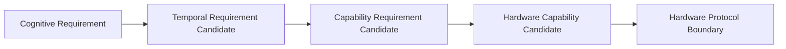

# Cognitive–Embodiment Temporal Contract v1

Example: `visual_observation` may propose latency <100ms, high frequency, and 10s duration; it never says “open camera.” Middleware matches capability/resource candidates; Hardware Protocol alone governs device operations.
