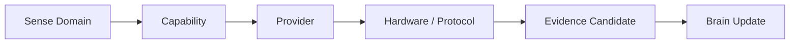

# Cognitive Embodiment Whitebox Architecture v1

## Purpose

Embodiment Whitebox is a future local, read-only view that shows how a Brain information need reaches a Sense Domain, Capability, Provider, Hardware/Protocol boundary, and returns Evidence. It must not be a simple model-call log or device-control console.

## Required views

| View | Shows | Cannot do |
|---|---|---|
| Sense Domain | Vision, Audio, Language, Touch, Proprioception, Environment classification | expose a model as Brain authority |
| Capability | requested evidence operation and allowed scope | create Goal/Attention |
| Provider | candidate alternatives, contract/resource/reliability/lifecycle traits | claim execution/answer is final |
| Hardware / Protocol | device profile, telemetry, health, calibration, power/hot-plug candidates | control device from UI |
| Evidence | source/scope/time/confidence/uncertainty/trace | confirm truth |
| Brain Update | Context/Workspace/Self State/Attention adjustment candidates | mutate State or action |

## Trace chain

`Brain Need → Neural Capability Signal → Sense Domain → Capability → Provider Candidate → Hardware/Protocol → Evidence Candidate → Cognitive Update`

Existing Model Test Lens and diagnostics assets may become presentation sources after a separate approved migration review. Whitebox remains trace projection only.

## Status

`COGNITIVE_EMBODIMENT_WHITEBOX_ARCHITECTURE_READY_WITH_NOTES`

`WAITING_FOR_USER_TERMINAL_VERIFICATION`
