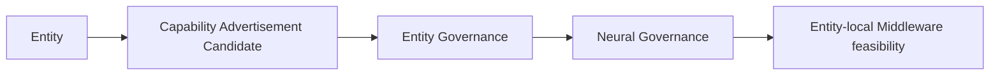

# Entity Capability Advertisement Model v1

## Definition

Entity Capability Advertisement is the protocol-safe declaration of an Entity's locally available capability roles, constraints, and status. It enables CWO routing and Middleware feasibility analysis without allowing an Entity to request a Goal or direct cognitive attention.

```text
EntityCapabilityAdvertisement {
  entity_ref,
  capability_roles,
  input_output_contracts,
  resource_profile,
  reliability_limit,
  availability,
  degradation,
  trust_state,
  protocol_version,
  trace
}
```

## Example

```text
Entity A — Glass
- visual capture capability role
- text-evidence input capability role
- spatial-sensor capability role

Entity B — Badge
- audio-capture capability role
- voice-output capability role
```

## Flow



## Boundaries

- Advertisement ≠ Goal request.
- Advertisement ≠ Attention request.
- Capability role ≠ Provider invocation.
- Health/availability metadata ≠ cognitive fact.
- An Entity cannot use its advertisement to rewrite a CWO or self-assign work.
