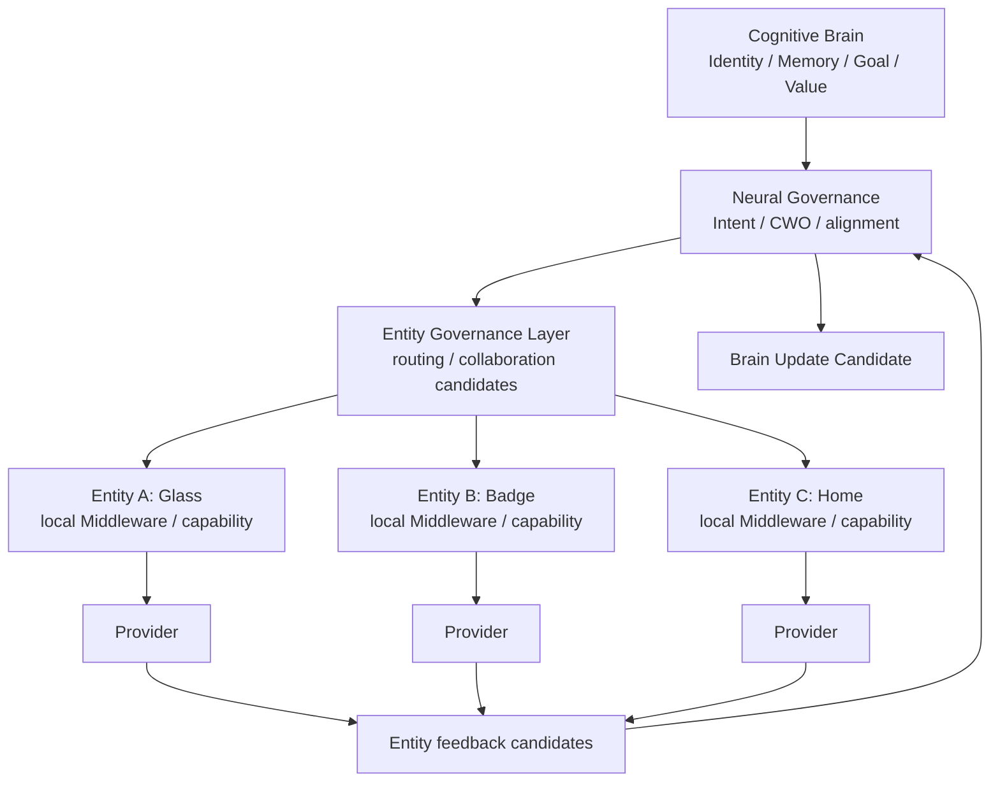

# Cognitive Entity Governance Architecture v1

## Phase

`Phase-Cognitive-Entity-Governance-and-Multi-Embodiment-Architecture-v1-001`  
Execution mode: V0 — architecture planning and static validation only.

## Definition

Entity Governance is the bounded coordination layer that connects one Cognitive Brain, through Neural Governance, to multiple embodied execution nodes. It routes work candidates to suitable Entity candidates, preserves entity ownership and trust boundaries, and returns entity feedback through Neural Governance.

An Entity is an embodiment node. It is not a Brain, Personality, Independent Agent, Goal owner, or Memory authority.

## Entity responsibilities

- embodiment identity and locally declared capability profile;
- local resource and connection condition reporting;
- local capability execution environment through its Middleware boundary;
- bounded reflex, health, safety, network-recovery, and local-cache protection;
- trace-linked capability/status/failure feedback.

## Prohibited entity authority

- Personality, Identity, Value, Goal, or long-term Memory authority;
- independent cognitive Brain formation;
- independent long-term Experience evolution;
- Decision or Action authority;
- direct Brain state mutation;
- rewriting CWO purpose or completion semantics.

Entity Governance is a planning-level architectural contract only. It creates no Entity Manager, Runtime, hardware connection, model integration, or multi-device execution behavior.
