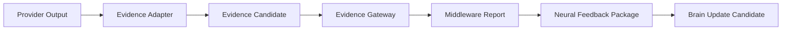

# Evidence Flow Alignment Review v1

## Target flow

## Current alignment

| Segment | Current asset | Alignment | Gap / bypass risk |
|---|---|---|---|
| Provider output | Legacy Provider/model adapters and runtime helpers; local model artifacts. | Legacy only. | Can remain model-first unless future session adapter is mandatory. |
| Evidence Adapter | `cognitive/adapters/` and `cognitive/evidence/` are synthetic-only; legacy normalizers/context builders exist. | Partial. | No unified CWO/session-bound non-synthetic adapter. |
| Evidence Candidate | Immutable generic Candidate contract exists. | Strong contract base. | Evidence source whitelist currently synthetic. |
| Evidence Gateway | Architecture contract and legacy fusion/normalization support. | Planning/partial. | No implementation that enforces Gateway as sole return path. |
| Middleware Report | Architecture contract; legacy diagnostics/result builders. | Partial. | Needs explicit coverage/missing/conflict/unknown projection. |
| Neural Feedback | Architecture contract only. | Missing implementation. | Must not be folded into Provider/Model Manager. |
| Brain Update | Candidate-only skeleton supports output candidates. | Partial. | Latest Brain context/sufficiency integration is not implemented. |

## Bypass assessment

No A-route real Provider path is currently connected, so no live bypass is active in the A-route skeleton. However, legacy model/runner/result paths are potential architectural bypasses if connected without the future Provider Session and Evidence Gateway adapters.

## Required future invariant

Provider output must never be passed directly to Brain, Context, World Understanding, Decision, Action, Memory, or Reducer. Every output must retain source, provider, capability, confidence, uncertainty, scope, status/conflict, and trace provenance.
