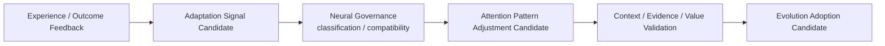

# Experience and Adaptation Architecture v2

## Reconciled placement

Experience and adaptation belong to the Brain-side evolution boundary. They do not reside in Middleware or Neural Layer as authorities. Neural Architecture only governs the transport/compatibility of an `Adaptation Signal Candidate` when an approved evolution path needs it.

## Ownership and prohibitions

| Stage | Owner | Output | Prohibition |
|---|---|---|---|
| Experience formation | Brain evolution boundary | Experience Candidate | experience is not truth/rule |
| Adaptation proposal | Brain evolution boundary | Adaptation Signal Candidate | no direct attention mutation |
| Neural governance | Neural Protocol Manager boundary | compatibility/trace/evolution transport candidate | no adoption decision |
| Pattern adjustment | Brain Attention governance | Attention Pattern Adjustment Candidate | no direct allocation write |
| Validation | Brain / Cognitive Governance | validation result candidate | frequency/popularity cannot replace value |
| Evolution | controlled evolution boundary | adoption candidate | no runtime self-rewrite |

## Frozen rule

`Experience → Attention` direct mutation is forbidden.

Only this controlled route is valid:

`Experience → Adaptation Candidate → Neural compatibility governance → Attention Pattern Adjustment Candidate → Validation → Evolution Adoption Candidate`

Current evidence remains prior to experience guidance; experience cannot override Reality or Evidence Field.

## Status

`COGNITIVE_EXPERIENCE_ADAPTATION_ARCHITECTURE_V2_READY_WITH_NOTES`

`WAITING_FOR_USER_TERMINAL_VERIFICATION`
