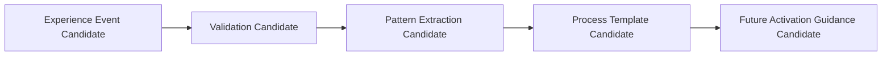

# Experience Consolidation Architecture v1

Experience Consolidation turns validated experience events into reusable process guidance candidates.

Experience is not raw Memory and cannot automatically modify Brain, Neural, Middleware, Attention, or Runtime behavior. Consolidation is Candidate → Validation → Adoption only; automatic learning is out of scope.
