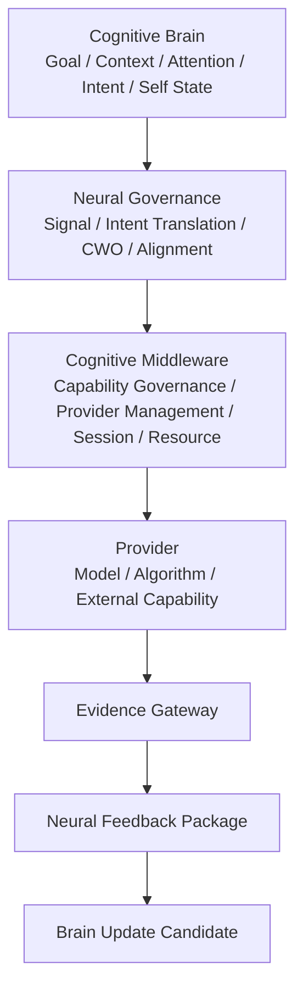

# Cognitive Foundation Architecture Review v2

## Review scope

`Phase-Cognitive-Foundation-Architecture-Code-Reconciliation-v1-001`  
Execution mode: V0 — read-only review only.

## Frozen A-route chain

## Layer review

| Layer | Frozen responsibilities | Boundary review |
|---|---|---|
| Brain | Goal/Context/Attention/Intent/Self State/Workspace/Evaluation/Feedback candidates. | Correctly excludes direct model/provider/hardware execution and final truth/action. |
| Neural Governance | Signal governance, Intent translation, CWO, signal organization, objective alignment, feedback aggregation. | Correctly excludes scheduling, Provider execution, resource enforcement, truth, decision, and action. |
| Middleware | Situation report, objective decomposition, capability/provider candidate resolution, resource/lifecycle constraints, session/report organization. | Correctly excludes cognitive purpose, attention allocation, cognitive completion, truth, decision, and action. |
| Provider | Local model/algorithm/external capability output. | Must remain behind Session + Evidence Gateway boundary. |
| Evidence/Feedback | Evidence candidate packaging, report, alignment, Brain update candidate. | Evidence remains non-factual; only Reducer may mutate state. |

## Overlap review

1. **Neural vs Middleware:** Neural defines/aligns work semantics; Middleware defines feasible capability execution organization. No overlap is permitted at Provider selection or cognitive completion.
2. **Middleware vs Provider:** Middleware organizes/candidates; Provider returns bounded local output. Neither owns truth.
3. **Evidence vs World Understanding:** Gateway packages source/uncertainty/provenance; Brain evaluates context-bound understanding. No provider/evidence fact shortcut exists in the target architecture.
4. **A vs B:** A-route only acquires and organizes current-reality evidence. Simulation, action candidates, and body-model logic remain outside this review.

## Architecture result

The target architecture is complete enough to assess a controlled provider skeleton. The remaining issue is code realization of the Neural/CWO/Middleware adapters—not a missing authority model.
