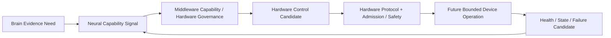

# Hardware Control Boundary v1

## Boundary

Hardware control is an Embodiment Governance boundary. The Brain may express an evidence need; it cannot directly sleep, wake, power, or diagnose a device. Middleware can resolve future hardware-control candidates only through Hardware Protocol, Registry/Admission, Resource, Safety, and permission constraints.

## Permitted control categories

| Category | Allowed conceptual operation | Required future boundary | Prohibition |
|---|---|---|---|
| Power State | request power state transition candidate | hardware protocol + permission/admission + resource/safety validation | no autonomous world action |
| Sleep | request bounded device/sensor sleep candidate | lifecycle/session/health validation | no Goal/Attention change |
| Wake | request bounded device/sensor wake candidate | admission/resource/availability validation | no automatic task creation |
| Diagnostics | request health/capability report candidate | hardware protocol and trace boundary | no truth/decision output |
| Local protection | device-local thermal/energy/failure protection | embodiment safety contract | cannot move body or change world state |

## Control flow

## Frozen prohibitions

- Hardware cannot autonomously modify Goal.
- Hardware cannot autonomously make a cognitive Decision.
- Hardware cannot directly modify Brain State, Context, Workspace, Attention, or Self State.
- Middleware cannot issue a direct hardware command outside future approved admission/permission/runtime boundaries.
- Hardware control cannot be used as an external-world Action authority.
- Reducer remains the only State Mutation Authority.

## Status

`COGNITIVE_HARDWARE_CONTROL_BOUNDARY_READY_WITH_NOTES`

`WAITING_FOR_USER_TERMINAL_VERIFICATION`
