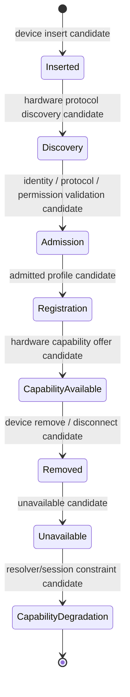

# Hardware Hot Plug Lifecycle v1

## Purpose

Hot Plug lifecycle describes how an attached or removed embodiment capability becomes visible to Capability Governance without turning hardware change into cognitive authority or direct action.

## Lifecycle semantics

| Stage | Owner | Output | Must not do |
|---|---|---|---|
| Insert | Body / Hardware Protocol | device-insert candidate | create Goal or session |
| Discovery | Hardware Protocol Adapter | discovery/profile candidate | self-admit device |
| Admission | Capability Governance + shared protocol/permission checks | admission/constraint/failure candidate | invoke hardware |
| Registration | Hardware Registry View | registered embodiment capability candidate | imply execution |
| Capability Available | Middleware | hardware capability offer/availability candidate | activate Attention by itself |
| Remove | Body / Hardware Protocol | remove/disconnect candidate | alter Brain Context directly |
| Unavailable | Middleware | unavailable/failure candidate | hide uncertainty or erase prior evidence |
| Capability Degradation | Middleware / Neural State Signal | session/attention constraint candidate | modify Goal, Decision, or State directly |

## Hot-plug rule

Device insertion does not make a new sense active. Device removal does not delete Cognitive Memory or Experience. Both only change the set of feasible Capability Candidates and emit explicit State/Reflex signals for Brain-side Self State and Attention governance.

## Status

`COGNITIVE_HARDWARE_HOTPLUG_LIFECYCLE_READY_WITH_NOTES`

`WAITING_FOR_USER_TERMINAL_VERIFICATION`
