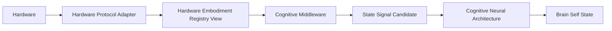

# Hardware Protocol Architecture v1

## Position

Hardware Protocol Layer is an Embodiment Governance concern inside Cognitive Middleware's hardware-management boundary. It translates device-specific discovery, registration, telemetry, health, calibration, power, and hot-plug events into candidate-shaped device/capability/state information. It is not the Cognitive Neural Protocol and cannot own cognitive meaning.

## Protocol responsibilities

| Concern | Hardware Protocol responsibility | Boundary |
|---|---|---|
| Device Discovery | observe an attached/discoverable device candidate | discovery does not equal admission |
| Registration | expose profile/identity/capability offer metadata for governance | does not self-register without admission/validation |
| Telemetry | report battery, temperature, connection, load, basic measurements | telemetry is State Signal input, not Memory |
| Health Report | report availability/degradation/permission/failure condition | cannot declare cognitive truth |
| Calibration | expose calibration/baseline reference and stale/valid condition | calibration does not modify Brain understanding |
| Power Management | express power/sleep/wake condition/control candidates | future device-local control only, no world action |
| Hot Plug | emit insert/remove/change candidates | does not create Goal/Attention |

## Existing asset reuse

- `hardware_profile_capability_registry_v1.py` supplies existing profile/capability/status concepts.
- `hardware_camera_control_contract_v1.py` and `hardware_camera_runtime_adapter_contract_v1.py` supply existing request, health, error, and adapter contract vocabulary.
- `DeviceStatusFeedbackEvent` and controlled camera archive assets supply existing feedback/trace direction.

## Status

`COGNITIVE_HARDWARE_PROTOCOL_ARCHITECTURE_READY_WITH_NOTES`

`WAITING_FOR_USER_TERMINAL_VERIFICATION`
