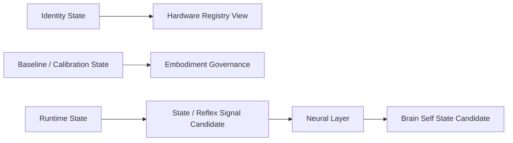

# Hardware State Management v1

## State classes

| State class | Duration | Examples | Owner/source | Boundary |
|---|---|---|---|---|
| Identity State | Long-lived | model, serial number, manufacturer, device class, firmware, protocol reference | Hardware Registry / admitted profile metadata | Not a Brain Identity or cognitive self identity. |
| Baseline State | Medium/long-lived | calibration profile, performance baseline, freshness, supported capability offer | governance baseline/calibration assets | Read for governance/diagnostic/calibration only; not normal Runtime input. |
| Runtime State | Real-time/short-lived | battery, thermal, connection, permission, sensor health, current load, capability availability | Hardware Protocol telemetry/health | Produces State Signal Candidate; cannot enter Memory directly. |

## State flow

## Frozen constraints

- Runtime State ≠ Memory.
- Runtime State ≠ Experience.
- Hardware identity ≠ Luna Identity.
- Calibration/baseline status ≠ provider truth/reliability guarantee.
- Middleware reports state candidates; Brain forms Self State Candidate; Reducer alone may mutate State.

## Status

`COGNITIVE_HARDWARE_STATE_MANAGEMENT_READY_WITH_NOTES`

`WAITING_FOR_USER_TERMINAL_VERIFICATION`
