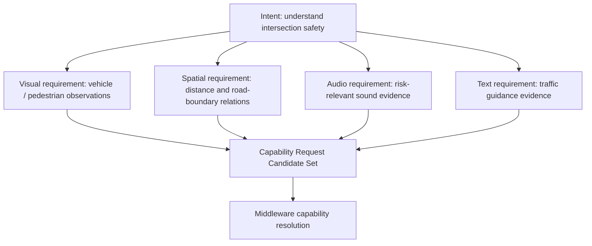

# Cognitive Intent Decomposition Model v1

## Purpose

Intent Decomposition translates one high-level information need into bounded, trace-linked Capability Request Candidates. It is a Neural protocol activity, not a planner and not provider selection.

## Decomposition rules

1. Preserve the parent intent, context, uncertainty target, and completion condition.
2. Split by information requirement, not by available model brand.
3. Request only the minimum evidence dimensions needed for current A-route sufficiency.
4. Produce candidates; capability resolution and provider selection remain Middleware responsibilities.
5. No decomposition output may contain action, movement, or simulation content.

## Example: understand intersection safety

| Child request candidate | Required information | Does not mean |
|---|---|---|
| Visual | Vehicle/pedestrian presence and observable motion cues. | A vehicle is dangerous or should be avoided. |
| Spatial | Relative distance, road boundary, crossing structure. | A route or movement plan. |
| Audio | Sound events relevant to risk uncertainty. | A certainty about unseen events. |
| Text | Traffic signs or text evidence where available. | Sign text is reality truth or an instruction to act. |

## Result lifecycle

`Intent Packet → child request candidates → middleware capability candidate set → provider/evidence responses → aggregation → completion candidate`

The decomposer records coverage gaps and dependencies. It cannot invoke a provider, allocate hardware, decide that the intent is complete, or open the frozen B route.
