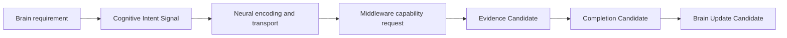

# Cognitive Intent Signal Model v1

## Phase

`Phase-Cognitive-Neural-Intent-Control-Architecture-v1-001`  
Execution mode: V0 — architecture planning and static review only.

## Purpose

A Cognitive Intent Signal is the Cognitive Brain's candidate expression of **what information it needs, why it needs it, and what would make the information sufficient**. It is sent through the Neural layer so that the Middleware can organize an appropriate capability response.

It is an information-requirement object, not an execution instruction.

## Required semantic fields

| Field | Meaning | Example |
|---|---|---|
| `intent_purpose` | Why the information is currently needed. | Reduce crossing-safety uncertainty. |
| `observation_requirement` | What evidence or observable structure is required. | Front-road structure; vehicle and pedestrian observations. |
| `attention_bias` | What the current allocation should preferentially emphasize. | Vehicle motion and pedestrian-road relation. |
| `relation_requirement` | Which relations must be understood rather than merely which entities detected. | Vehicle ↔ pedestrian ↔ road boundary. |
| `uncertainty_target` | The unknown that should be reduced. | Whether an approaching vehicle creates a crossing conflict. |
| `completion_condition` | Candidate condition under which the information may be sufficient. | Relevant relation coverage is adequate and critical unknown is below the task threshold. |
| `constraint` | Time, resource, safety, and scope limits. | Low-latency, no body-control request, bounded evidence scope. |

## Boundary

The intent may say: “more complete front-road structure information is required.” It must not say: “turn the body forward,” “move 30 cm,” or “operate camera X.”

Frozen invariants:

- Cognitive Intent ≠ Action Intent.
- Observation requirement ≠ movement instruction.
- Attention bias ≠ attention authority.
- Completion condition ≠ truth confirmation.
- Intent emission ≠ capability execution.

The following fields are forbidden in an intent signal:

- `decision`
- `action_candidate`
- `movement_plan`
- `motor_command`
- `future_state_simulation`
- `truth`

## Authority

| Layer | Permitted role | Forbidden role |
|---|---|---|
| Brain | Produces Cognitive Intent Candidate from active cognitive need. | Direct hardware/model invocation; action planning. |
| Neural | Encodes, validates, routes, decomposes, and traces the signal. | Goal, decision, truth, or action authority. |
| Middleware | Resolves capability options and reports delivery state. | Cognitive completion judgment; attention authority. |
| Provider | Produces capability output. | Interpreting output as reality truth. |

## Lifecycle

`Generated → encoded → routed → decomposed → evidence-linked → completion-candidate → brain-update-candidate → closed or refined`

Closing an intent signal only closes its current request lifecycle. It does not delete evidence, mutate memory, or change Reality state.
