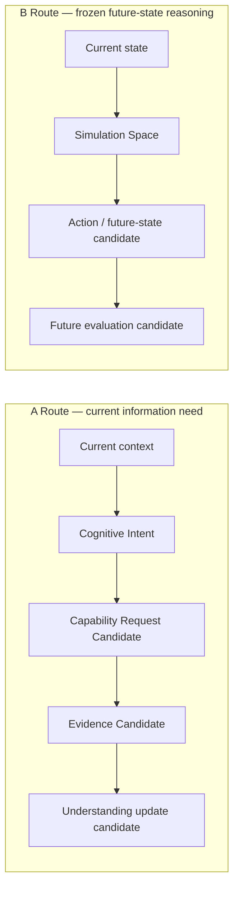

# Cognitive Intent–Simulation Boundary v1

## Frozen distinction

| Dimension | A Route: Cognitive Intent Control | B Route: Simulation / Body Model |
|---|---|---|
| Central question | What information is needed to understand the current situation? | If an action were taken, what future state might result? |
| Primary output | Intent, observation, relation, uncertainty, and completion requirement candidates. | Future-state, counterfactual, and action-related evaluation candidates. |
| Relation to observation direction | Describes needed evidence coverage only. | May evaluate how a hypothetical body/action change would alter observation. |
| Action content | Forbidden. | Candidate-only future action/body-model content, outside this phase. |
| Current status | A-route architecture is defined. | Frozen; not implemented or invoked. |

## Examples

Correct A-route intent: “Current side-oriented evidence is insufficient; obtain road, vehicle, pedestrian, and boundary relationship evidence to reduce crossing-risk unknown.”

Incorrect A-route request: “Turn the body to face forward and move 30 cm.”

The second statement is an embodiment/action proposal and belongs only to a separately governed future B-route body-model path. It must not be encoded in a Neural Intent Packet, decomposed into capability requests, or sent to Middleware by this phase.

## Shared but isolated inputs

A and future B may read current context, evidence candidates, workspace references, and self/resource constraints. They must not share authority such that:

- A-route observation direction becomes a movement command;
- B-route simulation output becomes Reality truth;
- B-route action candidate bypasses Decision–Execution boundaries;
- Simulation modifies A-route evidence or current-world understanding directly.
