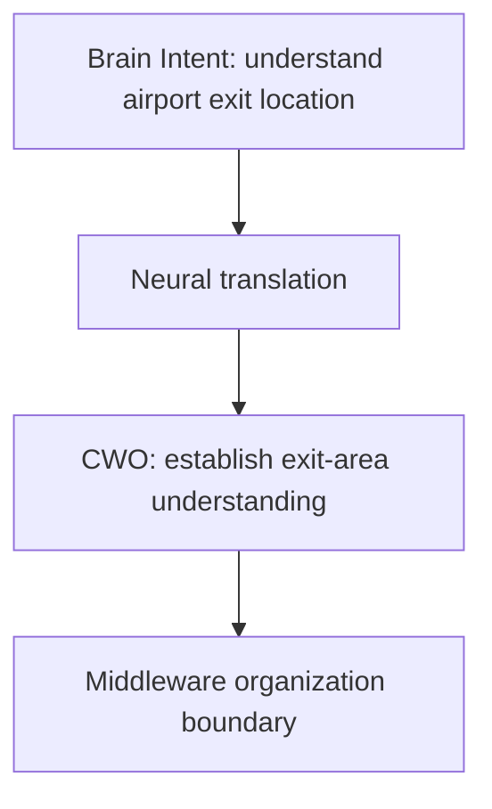

# Intent to Work Objective Translation v1

## Purpose

The Intent-to-CWO translation converts a Brain-level cognitive need into an execution-organizable understanding objective while preserving the original purpose and excluding model, hardware, action, and simulation directives.

## Example

| Brain Cognitive Intent | Cognitive Work Objective |
|---|---|
| Understand the airport exit location. | **Purpose:** establish current exit-area understanding. |
| Need current environment information. | **Required understanding:** exit-sign, spatial-position, and current-path relationship coverage. |
| Exit direction is unknown. | **Unknown target:** exit direction relative to current position. |
| Stop when the relation is sufficiently clear. | **Completion condition:** exit candidate relation is reported with explicit remaining uncertainty. |

## Translation rules

- Convert cognitive language into required-understanding, evidence, relation, unknown, completion, and constraint fields.
- Preserve contextual scope and parent trace.
- Keep completion condition candidate-based and separate from truth/cognitive sufficiency.
- Do not select a capability/provider or prescribe an execution sequence.

## Forbidden outputs

The translation must not directly generate:

- OCR invocation;
- VLM invocation;
- a Provider identifier;
- camera/device control;
- movement action;
- Action/Decision Candidate;
- B-route simulation or future-state content.

The Middleware receives an understanding-work objective, not a model call or action task.
