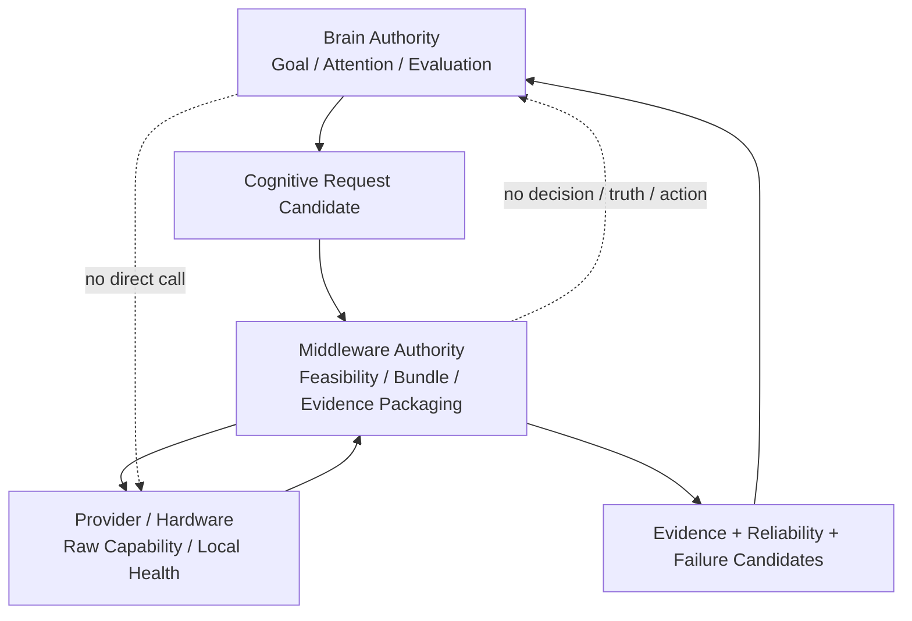

# Cognitive Middleware Authority Model v1

## Authority matrix

| 能力 / 权限 | Cognitive Brain | Cognitive Middleware | Hardware / Provider | Constraint |
|---|---:|---:|---:|---|
| Goal definition | ✓ | — | — | Goal is Brain-side candidate formation only. |
| Attention allocation | ✓ | — | — | Middleware receives attention context as a constraint, never authority. |
| Information requirement | ✓ | — | — | Brain determines why evidence is needed. |
| Capability discovery | request category only | ✓ | advertise only | Registry/Manager may report availability. |
| Capability selection candidate | need/constraint only | ✓ | — | Middleware proposes feasible bundle; Brain remains cognitive authority. |
| Resource limitation | need candidate only | ✓ | ✓ measurement | Resource restriction cannot silently override cognitive Goal. |
| Model lifecycle | — | ✓ | provider health input | Registration, health, degradation, replacement/retirement are Middleware concerns. |
| Hardware lifecycle | — | coordinates/reporting | ✓ local physical protection | No hardware lifecycle state becomes a cognitive conclusion automatically. |
| Evidence packaging | consumes/evaluates | ✓ | raw output only | Gateway preserves source, scope, confidence, uncertainty, trace. |
| Truth / fact judgment | evaluation candidate only | — | — | Current evidence is never fact by authority. |
| Cognitive decision | Decision Support Candidate only | — | — | A-route does not authorize final decision. |
| World action | — | — | — | Requires a future Human/Executor permission boundary. |
| Local device self-protection | receives safety event | reports/co-ordinates | ✓ limited | Limited to device protection; never a world action. |
| State mutation | — | — | — | Reducer remains the sole State Mutation Authority. |

## Authority separation diagram

## Non-escalation rule

No valid response from Middleware can acquire more authority than its request. In particular:

- a provider result cannot become Truth Authority;
- a resource failure cannot become Goal Authority;
- a capability bundle cannot become Attention Authority;
- a safety event cannot become a world Action command;
- a diagnostic trace cannot mutate State.

## Status

`COGNITIVE_MIDDLEWARE_AUTHORITY_MODEL_READY_WITH_NOTES`

`WAITING_FOR_USER_TERMINAL_VERIFICATION`
