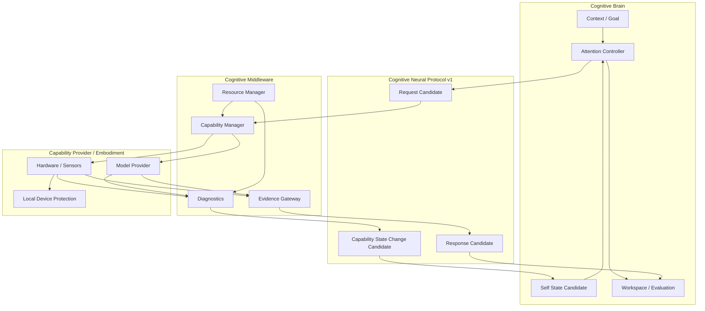

# Cognitive Middleware Neural Integration Architecture v1

## Phase

- Phase: `Phase-Cognitive-Middleware-Neural-Integration-Architecture-v1-001`
- Execution mode: Planning Only / V0.
- Scope: Brain–Middleware–Capability neural feedback and lifecycle integration.
- Non-goals: no code change, Runtime, model invocation, hardware access, migration, or Whitebox implementation.

## Integration objective

The three layers form a controlled neural loop:

1. **Cognitive Brain** determines why information is needed and what evidence would be sufficient.
2. **Cognitive Middleware** resolves how bounded capability can provide it and proactively reports capability/body state changes.
3. **Capability Providers** produce raw capability results or local health/safety signals.

The loop has two distinct information directions:

- **Cognitive request loop:** Brain need → Middleware capability resolution → evidence → Brain evaluation.
- **Neural feedback loop:** hardware/capability/resource change → Middleware feedback candidate → Self State Candidate → Attention adjustment candidate.

## Integration invariants

- Capability state feedback is proactive, but candidate-only.
- Self State Candidate constrains Attention; it does not directly allocate attention.
- Capability Session lifecycle is coupled to Attention lifecycle, not fixed time-to-live.
- Model Provider availability is not a task recommendation.
- Evidence Gateway is the only Middleware path returning cognition-facing information.
- Local device protection protects embodiment only; it does not decide, act in the world, or mutate Cognitive State.

## Status

`COGNITIVE_MIDDLEWARE_NEURAL_INTEGRATION_ARCHITECTURE_READY_WITH_NOTES`

`WAITING_FOR_USER_TERMINAL_VERIFICATION`
