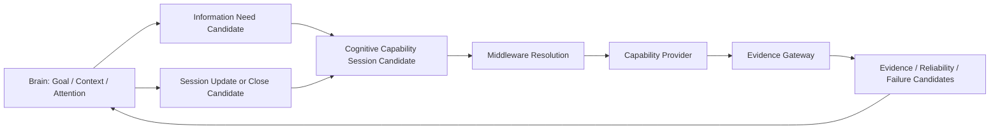

# Cognitive Middleware Operating Model Architecture v1

## Phase and scope

- Phase: `Phase-Cognitive-Middleware-Operating-Model-Architecture-v1-001`
- Execution mode: Planning Only / V0.
- Scope: operating model, session semantics, authority, reflex boundary, and capability lifecycle.
- Non-goals: no runtime, scheduler, API, model invocation, hardware access, code change, or migration.

## Operating-model premise

The Middleware does not execute a cognitive task. It maintains bounded **Cognitive Capability Sessions** through which the Brain can receive requested evidence over time. A session may be one-shot, streaming, paused, degraded, or closed; it is not a Goal, a Decision, a State authority, or an Action plan.

## Operating rules

1. Brain creates a request because an active Goal, Context, Attention allocation, and information gap justify it.
2. Middleware resolves **ways** to satisfy the request, subject to capability, lifecycle, health, and resource constraints.
3. A provider may generate raw signals repeatedly, but only Evidence Gateway returns cognitive-layer information.
4. Evidence may update Brain understanding and cause a new request/update candidate; it does not grant Middleware cognitive authority.
5. Any future session execution requires a separate Runtime Admission design and authorization. This document defines only the conceptual operating boundary.

## Session classes

| Session class | Example | Termination signal |
|---|---|---|
| One-shot evidence session | Read one sign through OCR | Evidence returned, failure, cancellation, or expiry |
| Bounded streaming session | Observe forward road conditions for navigation | Goal/attention change, budget/health constraint, explicit close |
| Background health session | Report sensor temperature or storage pressure | lifecycle/health policy change; never cognitive-task ownership |
| Diagnostic session | Gather trace/latency/reliability for a controlled trial | diagnostic window close |

## Status

`COGNITIVE_MIDDLEWARE_OPERATING_MODEL_ARCHITECTURE_READY_WITH_NOTES`

`WAITING_FOR_USER_TERMINAL_VERIFICATION`
